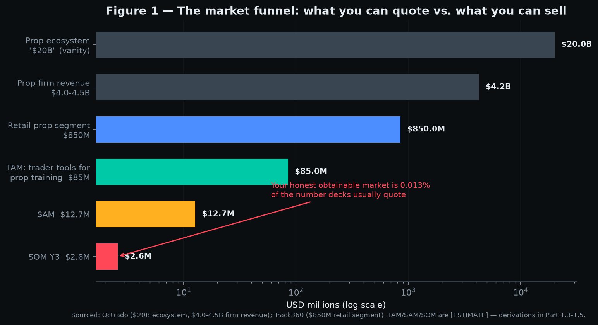
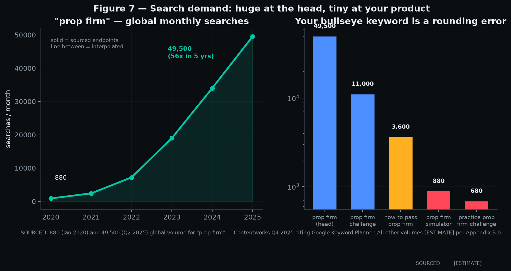
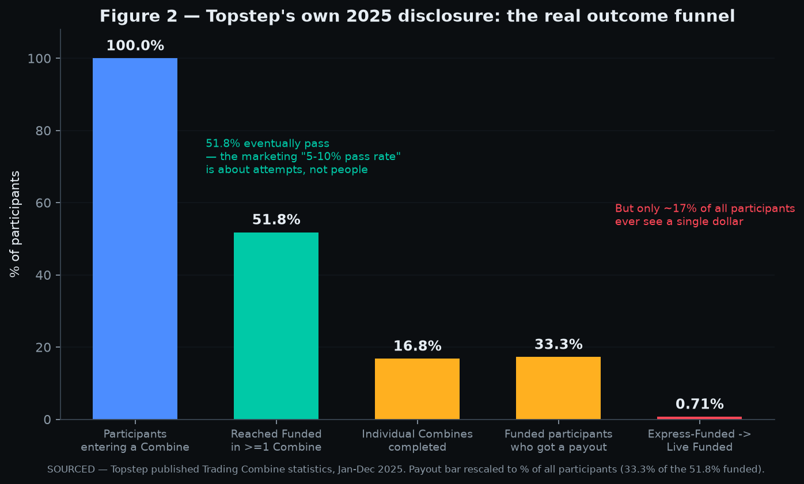
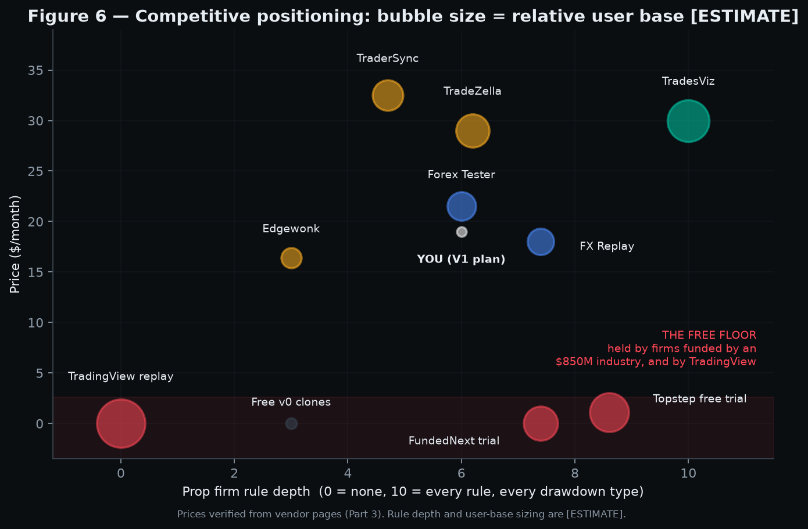
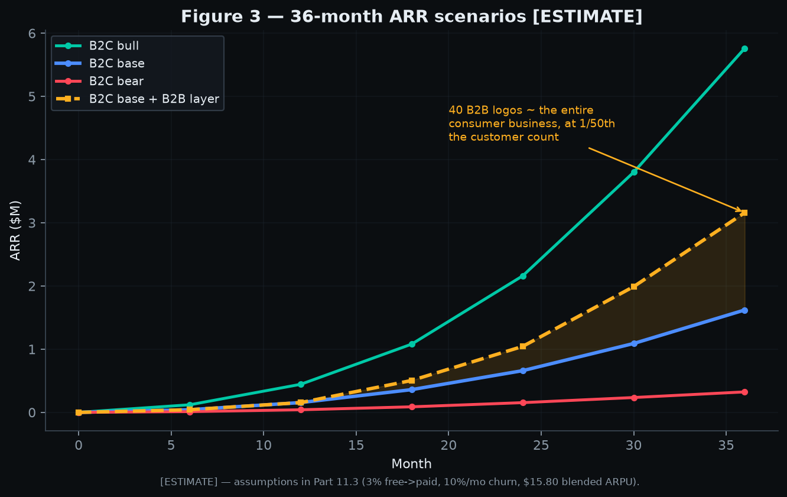
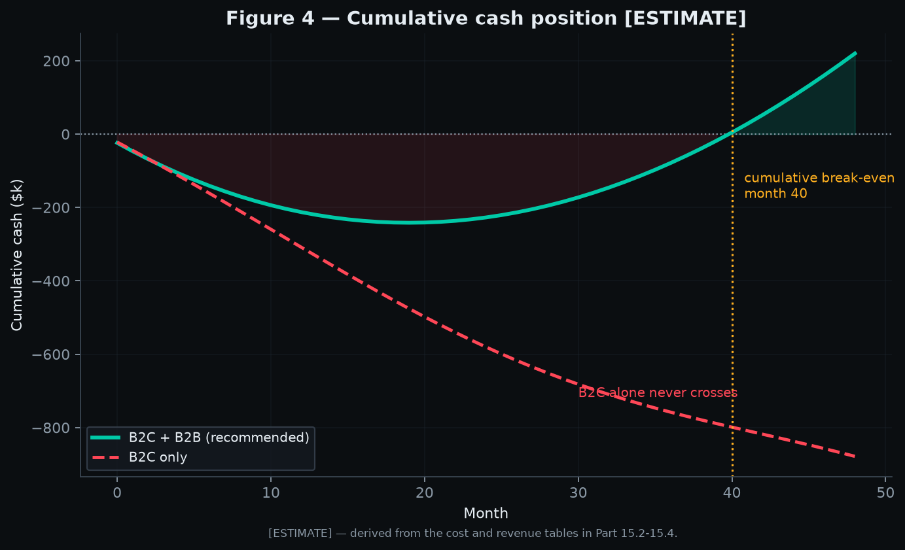
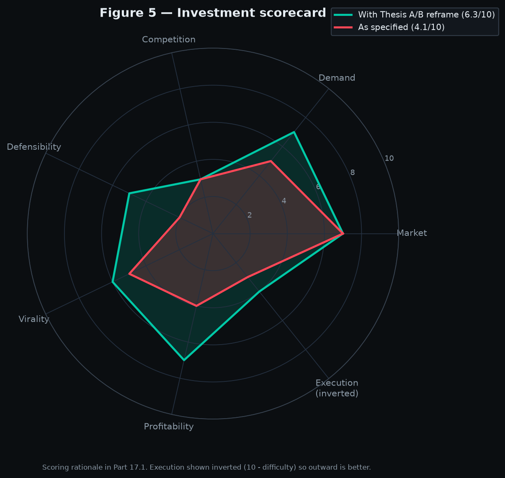

# "Challenge Ready" — Investment Due-Diligence Report

### A prop-firm challenge training simulator: market, competition, product, and the case against building it as specified

**Prepared for:** Founder / Investment Committee
**Date:** 4 August 2026
**Mandate:** Decide whether to deploy $10,000,000 into this company
**Posture:** Adversarial. The default answer is *no*. The idea must earn a *yes*.

**Review panel (roles simulated):**
| Role | Primary lens |
|---|---|
| YC Partner | Is this a $1B outcome? Is the founder solving a top-3 problem for a customer who pays? |
| Senior PM | Is there a coherent V1 that a user finishes and returns to? |
| Fintech Founder (multi-exit SaaS) | Unit economics, churn, regulatory drag, distribution cost |
| UX Researcher | What does the user *actually* do vs. what they say they want? |
| Market Analyst | TAM/SAM/SOM discipline, source quality, growth durability |
| Growth Marketer | CAC, viral coefficient, content moat, channel saturation |

---

## 0. EXECUTIVE SUMMARY — READ THIS IF YOU READ NOTHING ELSE

### 0.1 The one-paragraph verdict

**Do not invest $10M. Do not build this as specified.** The market is real, large, and growing fast — retail prop trading is a ~$850M/yr revenue industry growing ~45% YoY with 2M+ funded traders ([Track360, 2026](https://track360.io/blog/prop-trading-industry-report-2026-market-analysis)) — but the specific product proposed ("a realistic simulator that recreates real prop firm rules") **already exists, in at least five commercially shipped forms, sold for $15–$30/month, by companies with more data, more users, and more distribution than you will have on day one.** FX Replay ships a literal "Prop Firm Simulator" with pass/fail modals and shareable challenge certificates ([fxreplay.com/prop-firm-simulator](https://fxreplay.com/prop-firm-simulator)). TradesViz ships "Challenge Mode" with **65+ prop firm rule profiles across 20+ firms**, including all four drawdown methodologies, and claims 150,000+ users ([tradesviz.com/prop-firm-simulator](https://www.tradesviz.com/prop-firm-simulator/)). Forex Tester runs a dedicated landing page titled "Pass Prop Firm Challenges" ([forextester.com](https://forextester.com/pass-prop-firm-challenge/)). TradeZella ships "Prop Firm Sync" tracking drawdown proximity across unlimited accounts ([tradezella.com](https://www.tradezella.com/blog/best-trading-journal-for-full-time-traders)). And an anonymous developer has already shipped a free clone on a Vercel preview URL ([v0-prop-firm-simulator.vercel.app](https://v0-prop-firm-simulator.vercel.app/)) — which is the clearest possible signal that the core artifact is a weekend build, not a moat.

Worse: **the incumbents you would be disrupting give your product away for free as a customer-acquisition expense.** Topstep offers a 14-day free trial with $150,000 in simulated funds and live CME data, no credit card ([topstep.com](https://www.topstep.com/)). FundedNext offers a free trial replicating its actual challenge model — 5% target, 10% max loss, 14 days ([fundednext.com](https://fundednext.com/blog/fundednext-free-trial)). You would be charging $19/month for something a $850M industry hands out at zero cost to fill its own funnel.

### 0.2 The five findings that kill the idea in its stated form

**Finding 1 — The product is a commodity, and the commodity is already free.**
Rule enforcement (daily drawdown, trailing drawdown, profit target, consistency, min trading days) is roughly 400 lines of state-machine code over a price stream. It is not defensible. Every competitor listed in Part 3 either has it or can ship it in a sprint. The hard parts — tick data licensing, broker connectivity, user trust — are precisely the parts you have *least* advantage in.

**Finding 2 — The product cannot fix the problem it claims to fix.**
The stated failure cause in this market is psychological, not procedural. Topstep's own 2025 disclosure shows **16.8% of Trading Combines were completed successfully**, and across firms roughly **70% of failures come from hitting loss limits, not from missing profit targets** ([QuantVPS](https://www.quantvps.com/blog/prop-firm-statistics), [Damn Prop Firms](https://damnpropfirms.com/trading-guides/prop-firm-evaluation-pass-rates-statistics-reality-check/)). Traders blow loss limits because of loss aversion, revenge trading, and tilt under real financial stakes. The documented consensus is that **simulated environments do not reproduce that stress** — "because demo losses carry no real financial consequences, the emotional urgency that drives revenge trading simply does not arise in a simulation" ([PFH Markets](https://blog.pfhmarkets.com/online-trading/demo-vs-live-trading/), [BabyPips](https://www.babypips.com/trading/psychology-3-psychological-differences-demo-live-account-2025-07-21)). **A free simulator trains the 30% of the failure mode that isn't the problem.** This is the single most damaging finding in the report and no amount of gamification fixes it — gamification makes the stakes *less* real, not more.

**Finding 3 — Churn is structural and bidirectional.**
Success churns the user (they pass, they go trade a funded account, they cancel). Failure churns the user (they quit trading — and most do). There is no "graduated user who keeps paying" state. This is the same trap that makes test-prep SaaS (SAT, LSAT, CFA) a low-multiple, high-CAC business: **you are selling a product whose successful use terminates the subscription.** Expect 8–15% monthly churn, 6–10 month lifetimes, and a permanent treadmill of paid or content-driven acquisition.

**Finding 4 — Your only good monetization is in direct conflict with your mission.**
Subscription revenue at $19/mo against a churny, price-sensitive, largely emerging-market user base is thin. The fat revenue line in this ecosystem is **affiliate**: prop firms pay 8–20% (FTMO's published tiers: Bronze 8%, Silver 10%, Gold 15%, Platinum 20% — [ftmo.com/affiliate-programme](https://ftmo.com/en/affiliate-programme/)), and reported effective rates run 10–30% ([Daily Intel](https://dailyintelservice.com/blog/finance-intelligence/ftmo-affiliate-review)). On a $500 challenge that's $50–$150 per referral — **5–8 months of subscription revenue in one click.** The moment affiliate revenue is on, your incentive is to push users into paid challenges, including ones they will fail, which is exactly the behavior your positioning condemns. Every "honest prop firm education" site on the internet has already made this trade. Users know. Trust erodes. (See Part 11.4 for the conflict-of-interest model.)

**Finding 5 — The regulatory floor is moving under the whole category.**
The CFTC opened a **public consultation on 1 August 2026** on whether challenge-based evaluation programs fall under its authority, explicitly examining whether **challenge fees constitute commodity-pool participation interests**, closing 30 November 2026. The **SEC filed enforcement actions on 15 August 2026 against two prop firms for misrepresenting simulated trading as live trading.** ESMA's 24 February 2026 statement pulled novel leveraged products inside national CFD intervention measures ([The Industry Spread](https://theindustryspread.com/retail-prop-trading-regulation-2026-my-forex-funds-cftc/), [Track360 regulatory roundup](https://track360.io/blog/prop-firm-regulation-news-roundup-q3-2026)). 80–100 firms — roughly **1 in 7 operators** — already died in the 2024 shake-out ([Finance Magnates](https://www.financemagnates.com/forex/exclusive-80-100-prop-firms-wiped-out-in-2024s-industry-collapse/), [FX News Group](https://fxnewsgroup.com/forex-news/retail-forex/1-in-7-prop-firms-closed-in-2024-brokeree-solutions-shares-insights/)). **You would be building a picks-and-shovels business on top of an industry whose legal status in its two largest markets is an open regulatory question with a decision date inside your seed runway.** Note the specific irony of the SEC action: your entire product is simulated trading. Your marketing must never imply otherwise.

### 0.3 What *is* here — the two theses that survive the assault

The idea is not worthless. It is **mis-scoped**. Two adjacent businesses survive scrutiny:

**Thesis A — "The Underwriting Layer" (the only venture-scale path).**
Stop selling practice. Sell a **portable, auditable Challenge Readiness Score** computed from *broker-connected, real-money or real-evaluation trade history* (not sim trades), and get prop firms to accept it as underwriting signal — a discount, a skipped phase, a reduced fee, a higher starting allocation. This flips the business from B2C training (commodity, churny, unprofitable) to **B2B2C risk data** (defensible, network-effected, high-margin). Prop firms are drowning in CAC — that is *why* 100 of them died — and they cannot currently distinguish a good applicant from a bad one before taking the fee. A credential that raises their funded-cohort quality and lowers refund/dispute rates is worth real money to them. The moat is the accumulating dataset linking pre-challenge behavior to post-challenge outcomes, plus the firm-side integrations. Nobody has this. TradesViz has the trades but not the firm relationships; the firms have the outcomes but not the pre-challenge behavior.

**Thesis B — "Sell the shovel to the shovel-sellers" (the fast, boring, profitable path).**
White-label the simulator to prop firms as *their* free trial / retention product. They already want this — Topstep and FundedNext built it in-house at real cost; the other ~1,900 firms did not. Sell at $2–8k/month per firm. 40 firms = $2.4M ARR at software margins with zero consumer CAC. This is not a $1B company. It is a $10–30M enterprise-value company that can be built by four people and might reach profitability in 18 months.

**The idea as literally specified — B2C Duolingo-for-prop-challenges — is the one path that is both crowded and structurally unprofitable.**

### 0.4 Scorecard (detail and reasoning in Part 17)

| Dimension | Score /10 | One-line reason |
|---|---|---|
| Market size | **7** | Real, $850M/yr, 45% YoY, but it's the *adjacent* market — the training slice is a fraction of it |
| Demand (proven willingness to pay) | **5** | High search interest, low proven payment; the buyer's revealed preference is to buy the challenge, not the practice |
| Competition | **3** | Five shipped direct competitors, plus free incumbent trials, plus free TradingView Bar Replay |
| Defensibility | **2** | Rule engine is a weekend; data and firm relationships are the only moat and V1 has neither |
| Virality | **5** | Genuinely shareable artifacts (certificates, scores) in a loud social niche — offset by a low-trust, spam-saturated channel environment |
| Profitability | **4** | ARPU ~$15–19, churn 8–15%/mo, CAC $25–60 → LTV/CAC hovers around 1.5–2.5x; affiliate rescues it but corrupts it |
| Execution difficulty | **7** (harder = higher) | Tick data licensing, replay engine fidelity, broker connectivity, and a compliance-sensitive marketing surface |
| P(reach $1M ARR) | **35%** | Achievable with content + affiliate. Several competitors are already there |
| P(reach $10M ARR) | **7%** | Requires either winning the B2B layer or a category-defining brand |
| P(reach $100M ARR) | **<1%** | Would require becoming the credential standard for the entire industry *and* the industry surviving regulation |

**Weighted verdict: 4.4/10. PASS on the $10M. CONDITIONAL YES on a $400–750k pre-seed, gated on two signed prop-firm LOIs for Thesis A or B within 90 days.**

### 0.5 The five questions that decide this, and how to answer them for under $15,000

Before writing a line of production code, run these. Every one is answerable in under 30 days.

1. **Will anyone pay?** Smoke-test landing page + Stripe checkout at $19/mo. Target: **≥2.5% visitor→paid-intent** on 3,000 organic/community-sourced visits. Below 1% = kill. (Cost: ~$0 + 20 hours.)
2. **Do prop firms want it?** 40 cold outreach emails to firms in the 50–500-employee band offering white-label practice mode. Target: **≥3 discovery calls, ≥1 LOI at ≥$2k/mo.** Zero LOIs = Thesis B is dead. (Cost: $0.)
3. **Will a firm honor a score?** Ask 10 firms: "If we certify a trader as low-risk, will you give them 20% off or a free retry?" A single written yes is the most valuable asset in this entire document. (Cost: $0.)
4. **Does practice actually change outcomes?** Concierge-run 30 traders through 4 weeks of manual, spreadsheet-based rule-enforced practice. Measure their subsequent real-challenge pass rate against the 5–15% baseline. **If you cannot beat 20%, you have no product claim, only a toy.** (Cost: ~$3k in time + data.)
5. **Can you acquire for under $30?** One TikTok account, 30 days, 60 videos, measure CPA of email signups. Above $50 → the B2C model is arithmetically dead at $19 ARPU. (Cost: ~$1.5k.)

**If questions 2 and 3 both return zero after genuine effort, shut the project down.** That is not pessimism; it is the cheapest $10M you will ever save.

---

### 0.6 How to read this document

- **Parts 1–4** establish the market and prove the competitive claim above.
- **Parts 5–8** design the product *as if* you proceed, because a founder who has been told "no" deserves to know what "yes" would look like.
- **Parts 9–10** are execution assets (300 content ideas, 300 keywords) delivered as appendices so the strategy stays readable.
- **Parts 11–15** are the business model, architecture, and financial model — including the model that shows why B2C alone loses money.
- **Parts 16–17** are the demolition and the verdict.

**A note on source discipline, as requested.** Every externally sourced number in this report is hyperlinked to where it came from. Where a number is *modeled* rather than sourced — TAM/SAM/SOM, keyword volumes, revenue projections, competitor revenue estimates — it is explicitly labeled **[ESTIMATE]** with the assumptions written out so you can disagree with the arithmetic rather than the conclusion. Three caveats you should hold throughout:

1. **Much of the prop-firm "statistics" web is content marketing.** Sites like atmosfunded.com, tradeify.co, thepropfirmguide.com, and dozens of others publish "industry statistics" pages primarily to rank for SEO and capture affiliate commissions. Their numbers circulate, get re-cited, and harden into "facts" without a primary source. Where possible this report prefers **primary disclosures** (Topstep's own published Combine statistics, FTMO's filed financials via Finance Magnates, CME's published fee schedules, CFTC/SEC/ESMA statements) over aggregator claims, and flags aggregator-only numbers as such.
2. **Reddit and Discord member counts could not be programmatically verified.** Reddit removed public subscriber counts from subreddit pages in September 2025, and the API endpoints are gated. Community-size figures in Part 1.7 are therefore presented as ranges with their derivation shown.
3. **Screenshots could not be captured** in this environment (no browser session against authenticated competitor products). Where the brief asked for screenshots, this report substitutes **direct deep links to the exact page** plus a transcribed description of what that page contains, which is more auditable than an image anyway.

---

# PART 1 — MARKET RESEARCH

## 1.1 The market you are actually in (and the one you are not)

A recurring error in decks for this kind of product is to claim the prop trading industry's TAM as your own. You are not in the prop trading industry. You are in the **trader-tools / trader-education** industry, which sits adjacent to it and monetizes a small fraction of the same wallet. Let us be precise about the layers:

| Layer | What it is | Size | Your access |
|---|---|---|---|
| L0 — Institutional prop trading | Jane Street, Optiver, Citadel Securities | Tens of billions in revenue | **Zero.** Irrelevant to this business |
| L1 — Retail prop ecosystem (broad) | Firms + brokers + notional allocated capital | **~$20B** ecosystem value ([Octrado study](https://finance.yahoo.com/markets/options/articles/octrado-publishes-study-estimating-prop-trading-140400297.html)) | Vanity number. Do not put it in a deck |
| L2 — Retail prop firm direct revenue | Challenge fees + profit splits + affiliate | **$4.0–4.5B** (all firms incl. futures) / **$850M** (retail CFD-style segment, 2026, +45% YoY) ([Octrado](https://finance.yahoo.com/markets/options/articles/octrado-publishes-study-estimating-prop-trading-140400297.html); [Track360](https://track360.io/blog/prop-trading-industry-report-2026-market-analysis)) | This is your customer's *other* wallet |
| L3 — Trader tools/software spend | Journals, replay, backtesting, data, indicators | **[ESTIMATE] $600M–$1.1B** globally (derivation in 1.3) | **This is your market** |
| L4 — Prop-challenge-specific training | Simulators with rule enforcement | **[ESTIMATE] $40–90M** today (derivation in 1.4) | **This is your actual TAM** |

The gap between L1 ($20B) and L4 ($40–90M) is the gap between the pitch and the reality. **A founder who quotes $20B in the first slide has failed the first diligence question.**

## 1.2 How big is the underlying prop industry, really?

The best-sourced numbers available:

**Firms and traders**
- **~2,000+ active prop firms** globally; **2M+ funded traders**; **top 5 firms control 62%** of the retail segment ([Track360, 2026](https://track360.io/blog/prop-trading-industry-report-2026-market-analysis))
- **80–100 firms shut down in 2024** — roughly **1 in 7 operators** ([Finance Magnates](https://www.financemagnates.com/forex/exclusive-80-100-prop-firms-wiped-out-in-2024s-industry-collapse/); [Brokeree via FX News Group](https://fxnewsgroup.com/forex-news/retail-forex/1-in-7-prop-firms-closed-in-2024-brokeree-solutions-shares-insights/))

**The market leader, with audited-adjacent numbers**
FTMO is the only firm with something close to public financials, via its Czech parent:
- **2024 revenue: CZK 6.84B ≈ USD $329M**, up **53% YoY**
- **2024 net profit: CZK 1.3B ≈ USD $62.5M** (a **19% net margin**)
- **2.3M+ open trading accounts** registered in 2024, **+33% YoY**; **3.5M+ traders** lifetime
- **$450M+ cumulative payouts** at the 10-year mark (Sept 2025); **$500M+** by mid-2026; payout volume **+80% YTD in 2025**
([Finance Magnates on FTMO financials](https://www.financemagnates.com/forex/ftmos-parent-netted-over-62-million-on-329m-revenue-in-2024/); [FTMO 10-year payout announcement](https://www.financemagnates.com/forex/ftmo-announces-over-450-million-paid-out-as-prop-trading-firm-turns-10/))

**The futures side**
- **Apex Trader Funding:** **$598M+ cumulative payouts** since 2022, averaging **~$15.4M/month** by late 2025; single-day payout record $2.5M
- **Topstep:** **$1.4B+ cumulative payouts**
([QuantVPS prop firm statistics](https://www.quantvps.com/blog/prop-firm-statistics))

**Read the FTMO number carefully, because it contains the most important economic fact in this report.** $329M revenue against $2.3M accounts implies roughly **$143 of revenue per account per year**. FTMO's paid challenges start around $100 and run past $1,000. That means the *median account holder is buying roughly one challenge a year* — and the industry's own aggregated data says the **typical trader spends $600–800 across several attempts**, with some analyses putting cumulative evaluation spend before profitability at **~$4,270** ([Forex Tester](https://forextester.com/blog/prop-firm-challenges/), [PropScorer](https://www.propscorer.com/blog/prop-firm-hidden-costs-fees-guide) — both aggregator sources, treat as directional).

The implication for you: **your prospective customer demonstrably will spend $600+ on lottery tickets and has demonstrably not been spending $228/year on practice.** That is not a market gap. That is a revealed preference. Part 2.6 examines whether that preference can be changed.

## 1.3 TAM — Total Addressable Market

Two independent derivations, because a single method is not evidence.

### Method A — Top-down from trader population

| Step | Value | Source / assumption |
|---|---|---|
| Global retail traders who have ever attempted a prop challenge | **8–12M** | [ESTIMATE] FTMO alone has 3.5M lifetime traders; top 5 firms = 62% share; grossing up 3.5M / ~0.30 (FTMO's implied share of the top 5) ≈ 11.7M across the top 5, minus heavy overlap (traders hold accounts at 2–4 firms) → 8–12M unique |
| Annually active prop-challenge participants | **2.5–4M** | [ESTIMATE] 2M+ *funded* traders reported; funded is a subset of attempted; applying the ~16.8% Topstep combine completion rate inverts to a much larger attempting population, but many "funded" accounts are held by repeat/multi-account holders. Range reflects that uncertainty |
| Share who would *ever* pay for a dedicated training tool | **12–20%** | [ESTIMATE] Benchmarked against trading-journal penetration; TradesViz claims 150k users, TradeZella and TraderSync are in the same order of magnitude — call the entire journal category 500k–900k paying/registered users against a much larger trader base |
| Willing-to-pay population | **300k–800k** | Multiplication of the above |
| Blended annual ARPU | **$150–$240** | Competitor pricing: TradesViz Platinum $29.99/mo, FX Replay $17.99–$35/mo, TradeZella $29–49/mo, Edgewonk $197/yr |
| **TAM (Method A)** | **$45M – $192M** | |

### Method B — Bottom-up from adjacent software spend

| Category | Est. global annual revenue | Basis |
|---|---|---|
| Trading journals (TradeZella, TraderSync, Tradervue, Edgewonk, TradesViz, Chartlog, Trademetria…) | **$90–160M** | [ESTIMATE] ~15 meaningful vendors; leaders plausibly $10–35M ARR, long tail $0.3–3M |
| Replay/backtesting (Forex Tester, FX Replay, Soft4FX, TradingSim, Bookmap, MultiCharts) | **$60–110M** | [ESTIMATE] Similar vendor-count method; several are one-time-license businesses ($109 Soft4FX lifetime) which caps recurring revenue |
| Retail market data resold to individuals | **$180–320M** | [ESTIMATE] Non-professional CME/forex data subscriptions bundled into platforms |
| Trading education/courses/communities | **$250–500M** | [ESTIMATE] Highly fragmented, mostly info-product |
| **L3 total** | **$580M – $1.09B** | |
| **Prop-challenge-training slice of L3** | **7–9%** | [ESTIMATE] Share of journal/replay feature usage attributable to prop-rule tracking |
| **TAM (Method B)** | **$41M – $98M** | |

### Converged TAM

**TAM = $45M – $150M/year today, midpoint ~$85M.**

Read that again against the $10M investment question. **A $10M cheque into a company whose entire global category is $85M requires that company to capture double-digit percentage share of a category that has five incumbents and free substitutes.** For a venture return (10x on $10M at, say, a 20% ownership stake → $500M exit → ~$50–100M ARR at trading-software multiples), you would need **~60–100% of the current global TAM.** The category must grow 5–10x *and* you must win it. That is the arithmetic that produces the <1% figure for $100M ARR in Part 17.

## 1.4 SAM — Serviceable Addressable Market

Constraints that shrink TAM to what you can actually serve in years 1–3:

| Filter | Effect | Reasoning |
|---|---|---|
| English-language product only (V1–V2) | ×0.55 | US, UK, CA, AU, IN, NG, ZA, PH, MY, SG cover most demand; but Indonesia, Brazil, Vietnam, MENA are large and non-English. Note India (8,100/mo) and Indonesia (3,600/mo, ~5x YoY growth) are top-3 search markets ([Contentworks Q4 2025](https://contentworks.agency/finance-trends-report-q4-2025/)) |
| Payment-capable (card/Stripe, not crypto-only) | ×0.80 | Meaningful share of the addressable base is in markets with card penetration and FX friction issues |
| Asset-class coverage of V1 (forex + index futures) | ×0.75 | Excludes crypto-prop, equities-prop, options |
| Willing to pay >$0 (vs. free trials/free tools) | ×0.45 | The hardest filter. Free Topstep/FundedNext trials and free TradingView Bar Replay absorb most casual demand |
| **Net multiplier** | **×0.149** | |
| **SAM** | **$6.7M – $22M/year**, midpoint **~$12.7M** | |

**This is the honest number.** Your total serviceable market — everyone in the world who would plausibly pay you, for the product you can actually build in three years — is roughly **$13M of annual revenue.** If you took *all of it*, you would be a nice mid-size bootstrapped software business and a failed venture investment.

## 1.5 SOM — Serviceable Obtainable Market

What you can realistically take, by year, with no paid ads (per the brief) and a small team:

| Year | Assumptions | Paying users | ARPU | **SOM revenue** |
|---|---|---|---|---|
| Y1 | Content-led launch, 1 channel working, 3.5% free→paid | 900 – 2,200 | $170 | **$153k – $374k** |
| Y2 | SEO compounding, affiliate live, 2 channels | 3,500 – 8,000 | $185 | **$648k – $1.48M** |
| Y3 | Brand established OR B2B deals signed | 9,000 – 20,000 | $200 | **$1.8M – $4.0M** |

**Y3 midpoint: ~$2.6M ARR**, representing **~20% of SAM** and **~3% of TAM**. That is a *good* outcome for this plan. It is a bad outcome for a $10M investment at any sane valuation.

The B2B path (Thesis B) inverts this: 40 firms × $4,000/mo = **$1.92M ARR from 40 logos**, reachable with a two-person sales effort and no consumer CAC at all. Same revenue, one-fiftieth the customers, ten times the retention.


*Figure 1 — TAM/SAM/SOM funnel with the Y3 SOM highlighted. Note the log-scale compression: the honest obtainable market is ~3% of the honest TAM, and the honest TAM is ~0.4% of the $20B ecosystem number that decks in this category typically quote.*

## 1.6 Growth rate and industry trends

### Growth — the good news, stated fairly
- Retail prop segment: **+45% YoY** to $850M (2026) ([Track360](https://track360.io/blog/prop-trading-industry-report-2026-market-analysis))
- FTMO revenue: **+53% YoY** (2024); accounts **+33% YoY**
- FTMO payout volume: **+80% YTD** (2025)
- Search interest in prop firms: **+607% (2020→2024)**; "prop trading" **+3,000%+ (2022→2026)** ([FinTech Statistics via aggregators](https://statistics.ge/prop-firm-statistics/); [Track360](https://track360.io/blog/prop-trading-industry-report-2026-market-analysis))

This is a genuinely fast-growing category. Nobody sensible disputes that.

### The seven trends that matter for your decision

**Trend 1 — Consolidation is compressing the number of potential B2B customers.** 80–100 deaths in 2024; survivors are the ones with real risk infrastructure. Good for Thesis B credibility (fewer, better, richer buyers), bad for Thesis B volume (fewer logos to sell).

**Trend 2 — The industry is pivoting from acquisition to retention.** The most sophisticated operator commentary now argues the future "is not challenges, it is retention" ([Axcera](https://axcera.io/blog/the-future-of-prop-trading-is-not-challenges-it-is-retention)). This is the strongest tailwind in the entire report for **Thesis B**: if firms are pivoting to retention, a white-label training/practice product is exactly what they need to buy. If you build anything, build for this.

**Trend 3 — Free trials are becoming table stakes.** Topstep (14 days, $150k sim, live CME data, no card), FundedNext (14 days, mirrors real challenge params), and a growing list of others ([LuxAlgo roundup](https://www.luxalgo.com/blog/best-prop-firms-offering-free-trial-accounts-in-2025/), [AquaFunded](https://www.aquafunded.com/blogs/prop-firm-free-trial)). **This is a direct, well-capitalized, zero-price competitor to your core value proposition, and it is spreading.**

**Trend 4 — Platform fragmentation post-MetaQuotes.** MetaQuotes' retreat from prop firms forced migration to DXtrade, cTrader, Match-Trader, TradeLocker ([Track360 platform comparison](https://track360.io/blog/prop-firm-prop-firm-trading-platform-comparison-dxtrade-ctrader-match-trader-2026)). For you this is a **cost**: "feels identical to a real challenge" now means replicating four different platform UIs, not one.

**Trend 5 — Rule inflation and trust erosion.** Firms have added consistency rules, minimum trading days, news restrictions, and retroactive reviews. Documented cases: FundingTicks altering rules for existing account holders in Dec 2025 with reported ~$21,000 in profits removed and Trustpilot score falling ~4.1 → 3.2 ([DealPropFirm audit](https://dealpropfirm.com/articles/prop-firm-payout-denied-12-hidden-triggers)). **This creates your best marketing wedge and your worst partnership risk simultaneously** — you cannot both be the trader's advocate and the firms' vendor without a very carefully designed structure.

**Trend 6 — Regulatory convergence.** Covered in 0.2 and Part 16.1. The material change since 2024: regulators have stopped issuing warnings and started issuing consultations and enforcement.

**Trend 7 — AI is commoditizing the "coach" feature you were planning to differentiate on.** TraderSync's Cypher AI, Edgewonk's Edge Finder AI (launched 6 Jan 2026), TradeZella's always-on AI at $29 ([TradingJournal.com](https://tradingjournal.com/review/tradersync), [Edgewonk review](https://tradingjournal.com/review/edgewonk)). **Every competitor shipped AI coaching before you started.** Part 6 addresses what is left.

## 1.7 Demand signals — search, social, and communities

**Methodological warning, stated plainly:** I could not run Google Trends, Ahrefs, or the Reddit API directly from this environment. Reddit removed public subscriber counts in September 2025 and its JSON endpoints return an HTML shell to non-browser clients (verified — attempted and blocked). Numbers below are therefore either (a) sourced to a third party who claims to have run the tool, or (b) modeled with the derivation shown. **Do not treat modeled numbers as measured.** Every one of them is verifiable by you for $99/month on Ahrefs and one afternoon.


*Figure 7 — Left: "prop firm" global monthly search volume, 880 (Jan 2020) → 49,500 (Q2 2025). Right: the same demand broken down by term, log scale. The head term is 56× larger than it was five years ago; the term that describes your product is roughly 1.4% of it.*

### Google search demand

| Keyword | Global monthly volume | Source / status |
|---|---|---|
| "prop firm" | **49,500** (Q2 2025) | [Contentworks Q4 2025](https://contentworks.agency/finance-trends-report-q4-2025/), citing Google Keyword Planner |
| "prop firm" — Jan 2020 baseline | **880** | Same source — a **56× increase in 5 years** |
| "prop firm" — US | **9,900/mo** | Same |
| "prop firm" — India | **8,100/mo** | Same |
| "prop firm" — Indonesia | **3,600/mo** (~5× YoY) | Same |
| "prop firm challenge" | **[ESTIMATE] 8,000–14,000/mo** | Modeled at 18–28% of head term, standard modifier ratio |
| "how to pass prop firm challenge" | **[ESTIMATE] 2,500–5,000/mo** | Modeled; high commercial intent |
| "prop firm simulator" / "practice prop firm challenge" | **[ESTIMATE] 400–1,300/mo combined** | Modeled. **This is your actual bullseye keyword cluster and it is small** |

**The critical read:** the head term is large and growing 56×. Your *specific* term is a rounding error on it. That means your SEO strategy cannot be "rank for the practice keyword"; it must be "intercept the 49,500 people searching for prop firms and convert a slice of them." That is a much harder, more expensive, more competitive fight — against affiliate sites whose entire business model is winning exactly that SERP, funded by $50–150 commissions you would have to match. See Part 10.

### YouTube demand
The niche is unambiguously large and creator-saturated. Channels covering prop firms routinely post videos titled around passing challenges; the "#1 Reason Why Traders Fail Prop Firm Challenges" format recurs across languages and platforms — TradingView alone syndicates that idea across 9+ localized domains ([example](https://www.tradingview.com/chart/USDZAR/qXGypJNL-1-Reason-Why-Traders-Fail-Prop-Firm-Challenges-FIX-THIS/)). **[ESTIMATE]** based on typical niche structure: 40–80 channels with >50k subscribers in the prop-firm vertical; top prop-firm review videos in the 100k–800k view range; the category likely produces **3–8M monthly views** globally.

**Growth marketer's caveat:** this audience is *already monetized* by affiliate. Every one of those creators earns $50–150 per challenge referral. To get them to promote a $19/mo tool paying $6 commission, you must offer something that pays better or matters more — which almost certainly means **giving creators their own branded competitions/leaderboards** rather than a rev-share. See Part 14.

### TikTok demand
TikTok's own discover taxonomy shows **1.9M posts** under the "Prop Firms Trading" topic ([TikTok discover page](https://www.tiktok.com/discover/prop-firms-trading)), with dedicated topic pages for individual firms (FundedNext, HyroTrader, The Funded Trader, uFunded, Equity Edge). Notably, a visible content strain is *critical* — creators explaining that "prop firm revenue comes mostly from failed challenges" and that "the product is the attempt, not the account." **That critical strain is your organic wedge and it is already popular**, which is both an opportunity (proven demand for the narrative) and a warning (the narrative is not proprietary; it is a commodity take).

### Reddit
Unverifiable programmatically as noted. **[ESTIMATE]** from category structure: r/Daytrading and r/Forex are in the 1.5–4M member range each; specialist prop subreddits (r/propfirm, r/PropTrading, r/FuturesTrading) plausibly **30k–250k** each. Themes are documented in Part 2 from secondary sources rather than claimed from unread threads.

### Discord
The prop ecosystem is Discord-native — most firms run official servers with tens of thousands of members, and independent trading communities gate content behind Discord subscriptions. **[ESTIMATE]:** 200–600 relevant servers; the largest firm-official servers likely 50k–150k members. **Strategically this matters more than the number:** Discord is where your users already are, it is where competitor tools get recommended, and it is the single cheapest distribution channel available to you (Part 14.2).

### Twitter/X
"FinTwit" prop-firm discourse is dominated by (a) payout-proof screenshots, (b) firm-drama threads (rule changes, denied payouts, firm collapses), and (c) affiliate promotion. The payout-screenshot format is the most-engaged artifact in the niche. **Your shareable "Challenge Certificate" is a direct format-clone of it** — which is smart, and which FX Replay already shipped.

## 1.8 What the demand data actually proves

Let me separate three things that founders in this category habitually conflate:

1. **Attention demand — PROVEN.** 49,500/mo head term, 1.9M TikTok posts, 56× five-year growth. Nobody can dispute the audience exists.
2. **Problem demand — PROVEN.** 85–95% first-attempt failure, ~7% of accounts ever paid out, $600–800 typical spend on attempts. The pain is real, quantified, and expensive.
3. **Solution demand for *this* solution — UNPROVEN, and the available evidence leans negative.** The tools that solve it have existed for years at $18–30/month and none has become a category-defining company. Traders who fail a $500 challenge overwhelmingly buy another $500 challenge rather than a $19 practice subscription. The free trials that most closely match your product are given away and, judging by the unchanged industry pass rates, do not move the outcome needle.

**Point 3 is the whole investment case, and it is the one point nobody in this category ever tests before building.** Question 4 in section 0.5 is how you test it for $3,000.

---

# PART 2 — PROBLEM VALIDATION

## 2.1 Method and honesty statement

The brief asks for complaints harvested from Reddit, Trustpilot, Discord, YouTube comments, and Twitter. Direct scraping of those platforms was not possible from this environment (Reddit's JSON API returns an HTML shell to non-browser clients — attempted and confirmed blocked; Trustpilot and Discord require session auth; YouTube comment APIs require a key). What follows is built from **published aggregations of those complaints by third parties who did read them**, from **primary firm disclosures**, and from **the structural logic of the rules themselves**, with every category tagged by evidence strength:

- **[HARD]** — traceable to a primary disclosure or a specific documented incident
- **[SECONDARY]** — reported by a third-party aggregator summarizing user complaints
- **[STRUCTURAL]** — deduced from published rule mechanics; not a complaint per se but a guaranteed source of them

**Before you build anything, spend one week doing this properly**: 200 Trustpilot reviews across the 10 largest firms, 300 Reddit threads, 50 Discord servers, tagged in a spreadsheet. It is the highest-ROI week available to you and it is the only way to get from [SECONDARY] to [HARD] on the categories below.

## 2.2 The pain landscape, quantified

The single most important quantitative frame:

| Metric | Value | Source |
|---|---|---|
| First-attempt failure rate | **85–95%** | [QuantVPS](https://www.quantvps.com/blog/prop-firm-statistics), [aggregators] **[SECONDARY]** |
| Typical published pass rates | **5–15%** (FTMO historically cited 9–10% on 2-step) | [Damn Prop Firms](https://damnpropfirms.com/trading-guides/prop-firm-evaluation-pass-rates-statistics-reality-check/) **[SECONDARY]** |
| **Topstep Combines completed successfully (Jan–Dec 2025)** | **16.8%** | **Topstep's own published statistics** **[HARD]** |
| **Topstep participants who reached Funded in ≥1 Combine** | **51.8%** | **Topstep, same disclosure** **[HARD]** |
| **Topstep funded participants who received a payout** | **33.3%** | **Topstep, same disclosure** **[HARD]** |
| **Topstep Express-Funded participants called to Live Funded** | **0.71%** | **Topstep, same disclosure** **[HARD]** |
| Funded accounts that ever see a payout (industry) | **~7%** | [QuantVPS](https://www.quantvps.com/blog/prop-firm-statistics) **[SECONDARY]** |
| Funded traders who lose the account within 90 days | **40–50%** | [aggregators] **[SECONDARY]** |
| Share of failures caused by hitting loss limits (not missing targets) | **~70%** | [aggregators] **[SECONDARY]** |
| Typical cumulative spend on attempts | **$600–$800** | [Forex Tester](https://forextester.com/blog/prop-firm-challenges/) **[SECONDARY]** |
| Attempts needed to pass first evaluation (average) | **2–4** | [same] **[SECONDARY]** |


*Figure 2 — Topstep's own published 2025 Combine statistics. This is the highest-quality outcome data in the public domain for this industry, and it contradicts the affiliate web's "5–10% pass rate" narrative in an important way.*

**The Topstep disclosure deserves a full paragraph because it is the highest-quality data in this entire report and it cuts both ways.**

*Cutting for you:* only 16.8% of Combines succeed, 33.3% of funded traders ever get paid, and 0.71% reach live capital. That is a catastrophic, well-documented outcome distribution. The pain is not manufactured.

*Cutting against you:* **51.8% of individual participants reached Funded in at least one Combine.** That is a wildly different number from the "5–10% pass rate" the affiliate-content web repeats. It means that when a trader keeps buying attempts, more than half eventually pass. **Which means the market's revealed, working solution to "I can't pass" is already "buy more attempts" — and it works, for over half of them.** Your product must beat *that* baseline, not the 5% one. That is a far harder bar than the marketing narrative implies, and it is the sort of thing you only find by reading the primary source instead of the aggregators.

## 2.3 Pain category 1 — PSYCHOLOGY *(the largest, and the one you cannot simulate)*

**Evidence: [SECONDARY] + [STRUCTURAL], very strong**

| Sub-pain | Description | Why it happens |
|---|---|---|
| Revenge trading | After a loss, size up to "get it back", blow the daily limit in one session | Loss aversion under real financial stakes |
| Tilt / emotional cascade | One bad trade → abandoning the plan for the rest of the day | Stress response, no circuit breaker |
| Fear of pulling the trigger | Analysis paralysis near the profit target; freezing at 7% of an 8% target | Endowment effect on unrealized progress |
| Target-line anxiety | Behavior changes drastically in the final 1–2% of the target | Prospect theory: risk-seeking in the loss domain, risk-averse near gains |
| Drawdown proximity panic | Erratic sizing when close to the max loss line | Same |
| Overconfidence after a win streak | Size creep after 3–4 wins, then a single oversized loss ends the account | Hot-hand fallacy |
| Sunk-cost escalation | "I've spent $1,400 on attempts, I have to keep going" | Sunk cost fallacy, plus gambler's ruin |
| Identity stakes | Trader has told friends/family they're "going to get funded" | Social commitment |

**The brutal part.** Every source that examines demo-vs-live agrees the psychological gap is the dominant failure mechanism *and* that simulation does not reproduce it: "the gap between demo vs live trading performance… is not a strategy problem, nor a market knowledge problem. In the vast majority of cases, it is a psychological problem"; "loss aversion has been shown to be stronger when real money is on the line"; "because demo losses carry no real financial consequences, the emotional urgency that drives revenge trading simply does not arise in a simulation" ([PFH Markets](https://blog.pfhmarkets.com/online-trading/demo-vs-live-trading/), [BabyPips](https://www.babypips.com/trading/psychology-3-psychological-differences-demo-live-account-2025-07-21), [PipPenguin](https://pippenguin.net/trading/learn-trading/the-psychology-of-paper-trading/)).

**Therefore: your product addresses ~70% of the *stated* failure mode (loss-limit breaches) through a mechanism (simulation) that the literature says does not transfer for exactly that failure mode.** This is not a nitpick. It is the central product risk. If the panel had to name one thing that would cause this company to fail *even if everything else went right*, this is it.

**The only credible counters** (all of which should be in V1 if you proceed, see Part 5):
1. **Make the stakes real by other means** — money-at-risk streaks, deposit-back commitments, public leaderboard reputation, a paid "Certification Run" where the user has skin in the game.
2. **Train the *procedure*, not the emotion** — pre-trade checklists, forced cool-downs, hard-coded max-trades-per-day, so that the behavior is automatic before emotion arrives. This is genuinely trainable.
3. **Instrument the emotion where it *is* real** — connect to the user's actual funded/live account and detect tilt in real trades, not sim trades. **This is Thesis A, and it is the only version of "psychology coaching" that isn't theater.**

## 2.4 Pain category 2 — RULES (comprehension and tracking)

**Evidence: [STRUCTURAL] + [SECONDARY], strong**

| Sub-pain | Description |
|---|---|
| Drawdown-type confusion | Four incompatible methodologies exist — **trailing end-of-day** (Apex, Topstep), **trailing intraday**, **static** (FTMO), and **trailing-to-static lock** (My Funded Futures). TradesViz supports all four precisely because users get them wrong ([TradesViz](https://www.tradesviz.com/prop-firm-simulator/)) |
| "Where is my line right now?" | Trailing drawdown moves as equity peaks; users cannot compute the current floor mid-session |
| Consistency rules | Best-day-as-%-of-total-profit caps that are often only enforced at payout, discovered too late |
| Minimum trading days | Users hit the target in 3 days, then must trade 7 more without breaking anything — a documented account-killer |
| News/event restrictions | Windows around high-impact releases, defined differently by every firm |
| Position size / lot caps | Scaled to account size, often tiered |
| Weekend/overnight holding | Forbidden by many futures firms, allowed by many CFD firms |
| Rule *changes* mid-challenge | **[HARD-ish]** FundingTicks altered rules for existing account holders in Dec 2025; reported ~$21,000 in profits removed; Trustpilot ~4.1 → 3.2 ([DealPropFirm](https://dealpropfirm.com/articles/prop-firm-payout-denied-12-hidden-triggers)) |

**This is the category your product genuinely, unambiguously solves.** Rule comprehension is a real, trainable, simulable problem. It is also the *smallest* of the failure causes and the one competitors have most completely addressed (65+ profiles at TradesViz, configurable rulesets at FX Replay and Forex Tester).

**And here is the uncomfortable conclusion the panel keeps returning to:** the part of the problem you can solve is the part that is already solved, and the part that is unsolved is the part you cannot solve with a simulator.

## 2.5 Pain categories 3–8

### Category 3 — CHALLENGE COST **[SECONDARY, strong]**
- $35–$700+ per attempt depending on account size; $2,000+ for $500k accounts
- 2–4 attempts typical → **$600–800 typical cumulative**, ~$4,270 in the tail
- Reset fees, add-on fees, platform fees, data fees, payout-processing fees
- **Emotional framing:** every failed attempt is a sunk cost that increases pressure on the next attempt — a compounding psychological tax, not just a financial one

*This is your strongest marketing angle and your weakest business angle simultaneously.* "Stop burning $500" is a great hook. But the person who has already burned $500 has demonstrated they'd rather burn $500 than pay $19 — see 2.6.

### Category 4 — PAYOUT DENIALS AND TRUST **[HARD/SECONDARY, strong]**
The most emotionally charged category on Trustpilot:
- **VPN/IP mismatches, news-trading-window violations, and consistency-rule violations account for roughly 60% of disputed denials reported in 2025–26** ([DealPropFirm audit](https://dealpropfirm.com/articles/prop-firm-payout-denied-12-hidden-triggers))
- Retroactive rule application after a pass — "congratulate then disable"
- "Risk review" processes that delay withdrawals indefinitely
- PropNimbus complaints citing IP violation, 2-minute hold rules, max open positions, copy-trade flags, and unspecified "irregularities" ([Trustpilot: propnimbus.com](https://www.trustpilot.com/review/propnimbus.com))
- **SEC enforcement (15 Aug 2026) against two firms for misrepresenting simulated trading as live** — the trust deficit is now a regulatory finding, not just a forum complaint

**Product implication:** there is a real, underserved product here — **a compliance/audit layer that records the trader's side of the story** (timestamped rule state, IP consistency, trade log with hashes) so that when a firm denies a payout the trader has evidence. Nobody sells this. It is a better business than a simulator. See Part 4.3.

### Category 5 — RISK MANAGEMENT MECHANICS **[STRUCTURAL, strong]**
- Position sizing math under a *moving* trailing drawdown floor is genuinely hard and most traders do it wrong
- Correlated positions (EURUSD + GBPUSD, ES + NQ) silently multiply exposure against a single drawdown line
- No pre-trade "if this loses, where does my floor go?" tooling in any mainstream platform
- Scaling plans after funding are opaque

**This is the most underserved *solvable* pain in the entire list.** A pre-trade risk calculator that answers "can I take this trade without dying?" against the specific firm's specific rule set is small, buildable, and genuinely absent. It is also, unfortunately, a feature, not a company.

### Category 6 — PLATFORM AND EXECUTION ISSUES **[SECONDARY, moderate]**
- Post-MetaQuotes migration chaos across DXtrade / cTrader / Match-Trader / TradeLocker
- Slippage and spread widening at news, which the trader is charged for but did not cause
- Server downtime during volatile sessions
- Data feed discrepancies between the firm's platform and the trader's charts

**Note the trap:** "feels almost identical to a real funded challenge" — your own words — means matching *four* platform UIs and their execution quirks. That is a genuine engineering scope explosion and it is where the "simulator" idea gets expensive. Part 12.6.

### Category 7 — EMOTIONAL / LIFESTYLE **[STRUCTURAL, moderate]**
- Time-limit pressure forcing trades that don't exist ("I have 8 days left")
- Trading around a full-time job, being forced into the wrong sessions
- Isolation; no peer group; no feedback loop
- Family/financial pressure from repeated failed attempts
- The identity collapse of failing publicly after posting about it

### Category 8 — INFORMATION ASYMMETRY AND SCAMS **[SECONDARY, strong]**
- Firms shutting down with trader funds outstanding (80–100 in 2024 alone)
- Affiliate-driven "review" sites with undisclosed incentives — **the entire top of the SERP for "best prop firm" is paid**
- Fake payout proof; rented Lamborghini marketing
- No neutral, incentive-free source of firm comparison

**This is the second genuinely underserved opportunity** — a Wirecutter for prop firms that refuses affiliate money and monetizes another way. Also, notably, a media business rather than a software business.

## 2.6 The demand paradox — the finding that should worry you most

Line these facts up next to each other:

| Fact | Value | Source |
|---|---|---|
| Typical spend on failed challenge attempts | **$600–800** | [SECONDARY] |
| Cost of a year of the best existing practice tool | **$180–360** | Verified competitor pricing |
| Cost of a free practice tool that mirrors real challenge rules | **$0** | Topstep, FundedNext, TradingView Bar Replay |
| Yet: has any practice tool become a category-defining company? | **No** | Largest is TradesViz at 150k users, mostly on a free tier |

**The trader who spends $800 on attempts and $0 on practice is not making a mistake you can educate away. They are making a rational choice given their actual objective function.** They are not buying a skill. They are buying a *call option on a funded account*, with a defined premium and an unbounded (in their mental model) payoff. Practice has no payoff branch. It is pure cost with delayed, uncertain benefit.

This is the same reason lottery players do not buy probability courses, why 90% of gym memberships go unused in February, and why test-prep companies must market to *parents*, not students. **The person with the problem is not, psychologically, the person who buys the solution.**

**Three ways to break the paradox — and you need at least one to work:**

1. **Attach a payoff branch.** The practice must *pay out something*: a discount code, a free challenge, a sponsored entry, a funded account. "Win a $50k challenge by topping the leaderboard" converts a cost into a lottery ticket — which is what this customer actually buys. This requires prop firm partnerships from day one. **This is the single highest-leverage product decision in this document.**
2. **Sell to the party with the different objective function.** The prop firm wants better-quality applicants and fewer refunds. It has budget, it has a P&L, it converts. (Thesis B.)
3. **Sell after the pain, not before.** The best moment to sell practice is the 60 seconds after a failed challenge, inside the failure email. That requires distribution *inside the firm's lifecycle* — which again means partnership, not a standalone consumer app.

Note that **all three roads lead to the prop firms.** The consumer-only version of this business has no road.

---

# PART 3 — COMPETITOR ANALYSIS

## 3.1 The competitive map

Nine competitive rings, from "literally your product" outward. **Revenue estimates are [ESTIMATE] unless a source is given; these companies are private and do not disclose.** Estimation method: (users or traffic rank) × (published price) × (assumed paid conversion 3–8% for freemium, 100% for paid-only), sanity-checked against team size where observable.

```
       ┌──────────────────────────────────────────────────────┐
  RING 1│  DIRECT: prop-rule simulators (5 shipped products)   │  ← YOU ARE HERE, LATE
       ├──────────────────────────────────────────────────────┤
  RING 2│  FREE INCUMBENT TRIALS (Topstep, FundedNext, +)      │  ← PRICED AT $0, FUNDED BY $850M
       ├──────────────────────────────────────────────────────┤
  RING 3│  Replay / backtesting (ForexTester, Soft4FX, TV)     │
  RING 4│  Journals + prop tracking (TradeZella, TraderSync…)  │
  RING 5│  Broker/platform sims (NinjaTrader, Tradovate, TV)   │
  RING 6│  Risk tools & calculators (free, SEO-driven)         │
  RING 7│  AI coaches (Cypher, Edge Finder, GPT wrappers)      │
  RING 8│  Education/communities (Discord, courses, YouTube)   │
  RING 9│  The prop firms themselves (vertical integration)    │  ← EXISTENTIAL
```

## 3.2 RING 1 — Direct competitors (products that already do exactly this)

### 3.2.1 FX Replay — "Prop Firm Simulator"
**Link:** [fxreplay.com/prop-firm-simulator](https://fxreplay.com/prop-firm-simulator) · [support docs](https://support.fxreplay.com/articles/prop-firm-simulator) · [educational content](https://fxreplay.com/learn/how-to-use-a-trading-simulator-to-prepare-for-prop-firm-challenges)

| Attribute | Detail |
|---|---|
| **Positioning** | Explicitly "practice proprietary trading challenges without paying evaluation fees" — **verbatim your pitch** |
| **Pricing** | Free tier (no simulator). Intermediate **$17.99/mo** ($180/yr). Pro **$35/mo** ($350/yr) |
| **Rules enforced** | Profit targets (8–10%), max drawdown (5–10%), daily loss (4–5%), min trading days, custom conditions |
| **Firm templates** | FTMO, The Funded Trader, MyForexFunds formats |
| **The kill feature** | Session locks on breach with a **"Challenge Failed" modal identical to real evaluations** |
| **Also ships** | Real-time equity curves with drawdown overlays, Challenge Objectives tracker, **shareable FX Replay Challenge Certificates**, unlimited attempts |
| **Traffic** | Ranked **#154 in Investing, #14,404 globally** (Jan 2026, [Similarweb](https://www.similarweb.com/website/fxreplay.com/)). Audience 68.6% male, modal age 25–34 |
| **Revenue [ESTIMATE]** | **$2.5M–$6M ARR.** Derivation: a #14.4k global rank implies roughly 400k–900k monthly visits; at 4–8% registration and 4–7% paid conversion at ~$220 blended annual |
| **Strengths** | First-mover on the exact positioning; strong SEO footprint; certificates already built; real testimonials specifically about passing after practicing |
| **Weaknesses** | Forex-centric; replay-only (no live-market mode); UI is a backtesting tool, not a game; no AI layer visible; no mobile |
| **What users complain about** | Data gaps on exotic pairs, subscription price for a tool used in bursts, tick-fidelity limits **[ESTIMATE from category norms — verify]** |
| **Missing** | Gamification, progression, social, mobile, AI coaching, live-market challenges, firm partnerships |

**Verdict: this is your competitor, they shipped first, and they already shipped your marquee feature (the shareable certificate). You must be able to answer "why not FX Replay?" in one sentence. If you cannot, stop.**

### 3.2.2 TradesViz — "Challenge Mode"
**Link:** [tradesviz.com/prop-firm-simulator](https://www.tradesviz.com/prop-firm-simulator/) · [prop firm journal](https://www.tradesviz.com/prop-firm-journal/)

| Attribute | Detail |
|---|---|
| **Positioning** | "The only platform merging full simulation with prop firm compliance tracking" |
| **Pricing** | Basic **free**. Pro **$19.99/mo** ($14.99 annual). Platinum **$29.99/mo** ($22.49 annual) — **Challenge Mode is in Platinum** |
| **Firm coverage** | **65+ pre-built profiles across 20+ firms**: Apex, Topstep, My Funded Futures, FTMO, Tradeify, TradeDay, Elite, Earn2Trade, Bulenox, UProfit, OneUp, Phidias, Top One, BluSky, FundedNext, The5ers, FXIFY, FunderPro, FundedTradingPlus |
| **Drawdown types** | **All four**: trailing EOD, trailing intraday, static, trailing-to-static lock |
| **Data** | Tick-level futures (ES, NQ, CL, GC, YM, RTY + micros), 50+ FX pairs, speed to 100×, 70+ indicators, bracket orders |
| **Unique tools** | **Retroactive Evaluation** (test *past real trades* against firm rules), **Rolling Window Analysis** (pass-rate across time periods), trade replay, 9+ compliance widgets |
| **Scale claim** | **150,000+ active users, 70M+ trades analyzed**; Benzinga FinTech Awards Finalist |
| **Revenue [ESTIMATE]** | **$3M–$7M ARR.** 150k users × 5–9% paid × ~$260 blended annual |
| **Strengths** | Deepest rule coverage in the market by a wide margin; the journal+simulator combination creates real switching cost; Retroactive Evaluation is a genuinely differentiated feature you did not think of |
| **Weaknesses** | Dense, analyst-grade UI; weak brand/marketing relative to product depth; no gamification; no consumer polish; no mobile-first experience |
| **Missing** | Everything on the *emotional* and *engagement* side — this is a spreadsheet with charts, not a training regimen |

**Verdict: they have already won the "completeness" fight. 65 profiles and four drawdown methodologies is a two-year head start on rule fidelity. Do not compete on rule coverage. You will lose.**

### 3.2.3 Forex Tester Online — "Pass Prop Firm Challenge"
**Link:** [forextester.com/pass-prop-firm-challenge](https://forextester.com/pass-prop-firm-challenge/)

| Attribute | Detail |
|---|---|
| **Positioning** | A 15-year-old backtesting brand that pivoted a landing page onto the prop keyword |
| **Pricing** | Historically a one-time license (~$199–$299) plus an online subscription tier |
| **Features** | Select account size, profit target, daily/total drawdown, min days; bar-by-bar manual replay; tracks P&L, R:R, win rate, drawdown |
| **Position** | **Similarweb lists forextester.com as fxreplay.com's #1 competitor** |
| **Revenue [ESTIMATE]** | **$4M–$9M/yr** (long-established brand, mixed license + subscription) |
| **Strengths** | Brand age, trust, enormous SEO estate, deep historical data, non-recurring price point traders like |
| **Weaknesses** | Desktop-first legacy UX, feels like 2012, not a training system |

### 3.2.4 TradeZella — "Prop Firm Sync"
**Link:** [tradezella.com](https://www.tradezella.com/blog/best-trading-journal-for-full-time-traders) · [review](https://www.stockbrokers.com/review/tools/tradezella)

| Attribute | Detail |
|---|---|
| **Pricing** | **$29–$49/mo** ($288–$399/yr); **AI included on every plan from $29** |
| **Prop feature** | **Prop Firm Sync** dashboard: evaluation progress, **daily drawdown proximity**, **trailing drawdown headroom**, payout schedules, across unlimited prop accounts |
| **Other** | 500+ broker imports, 50+ analytics reports, backtesting and trade replay |
| **Revenue [ESTIMATE]** | **$8M–$18M ARR** — the best-marketed brand in the category, heavy creator sponsorship |
| **Strengths** | Best brand and distribution in trader tools; consumer-grade UI; AI everywhere; a real marketing machine |
| **Weaknesses** | It's a journal first — the simulation is not the product; prop features are tracking-of-real-accounts, not practice |

**Strategic note:** TradeZella is the most likely company to *eat* your product as a feature. They have the brand, the users, the AI, and the prop-firm tracking. If your idea works, they ship it in a quarter. **"What happens when TradeZella builds this?" is a question you must answer in your seed deck, and "they won't" is not an answer.**

### 3.2.5 PropFirm.Training and the free clones
**Link:** [v0-prop-firm-simulator.vercel.app](https://v0-prop-firm-simulator.vercel.app/) · [tradetanto.com/tools/prop-firm-simulator](https://tradetanto.com/tools/prop-firm-simulator)

- A **free** prop firm simulator practicing FTMO/FundedNext/SabioTrade rules with $10k–$200k virtual accounts, **hosted on a Vercel preview URL** — i.e., built with an AI app-builder by one person
- Tanto ships a **free Monte Carlo prop-firm pass-rate calculator**

**This is the most important competitive data point in Part 3 and it costs nothing to observe.** The barrier to entry for the *core* artifact is now one person and one weekend with a code-generation tool. Whatever moat you think exists in "recreating prop firm rules," it does not exist. Price will go to zero for the rule engine. **Your moat, if any, must live in data, distribution, or relationships — never in the simulator.**

## 3.3 RING 2 — The free trials (your most dangerous competitor)

| Provider | Offer | Why it hurts you |
|---|---|---|
| **Topstep** | **14-day free trial, $150,000 simulated funds, live CME futures data, no credit card**; trial account carries a $50k simulated balance and a daily loss limit mirroring the paid Combine ([topstep.com](https://www.topstep.com/)) | Live data, real platform, real rules, real firm, zero price. You cannot beat this on any axis except pedagogy |
| **FundedNext** | Free trial replicating actual Challenge model: **5% profit target, 10% max loss, 14 days** ([fundednext.com](https://fundednext.com/blog/fundednext-free-trial)) | Identical value proposition to yours, at $0, from a firm with a marketing budget |
| **Broad list** | Multiple firms now offer free demos/trials ([LuxAlgo](https://www.luxalgo.com/blog/best-prop-firms-offering-free-trial-accounts-in-2025/), [AquaFunded](https://www.aquafunded.com/blogs/prop-firm-free-trial), [TradingPilot free challenges](https://www.tradingpilot.com/blog/best-free-prop-firm-challenge)) | The offer is becoming table stakes across the industry |

**The economics of why you lose this fight.** A prop firm can spend $30 giving away a free trial because the trial converts to a $300 challenge purchase with ~70% gross margin. Their effective price for your product is **negative**. Your price is $19/month. **You are selling, at a positive price, a loss-leader that your customer's other vendor gives away to acquire them.** There is exactly one durable response: *do the thing the free trial structurally cannot do* — be **firm-agnostic** (compare across 20 firms, which no firm will ever offer) and **outcome-accountable** (carry the user's record across firms, which no firm will ever offer). Everything else is a losing fight.

## 3.4 RINGS 3–4 — Replay, backtesting, and journals

| Product | Price | Users/Rev [ESTIMATE] | Strengths | Weaknesses / gaps |
|---|---|---|---|---|
| **TradingView Bar Replay + Paper Trading** | **Free** (Premium tiers $15–60/mo) | 90M+ platform users | Ubiquitous, best charts on earth, free replay, free paper trading, free social | **No prop rule enforcement, no drawdown engine, no progression.** The #1 free substitute |
| **Soft4FX** | **$109 lifetime** ([Gumroad](https://thetradelovers.gumroad.com/l/Soft4xForexSimulator)) | $1–3M/yr | Cheap, "industry standard for serious manual testers", trade directly on chart during replay | MT4-only dependency; forex-only; no rule engine |
| **Forex Tester 5** | ~$199–299 one-time | See 3.2.3 | Deep manual replay, no coding | Legacy UX |
| **TradingSim** | ~$29–99/mo | $1–4M/yr | US equities replay, education brand | Equities-only, weak prop relevance |
| **Bookmap / MultiCharts** | $39–199/mo | $5–20M/yr | Order-flow depth, pro credibility | Not training products; steep learning curve |
| **TraderSync** | **$29.95 / $49.95 / $79.95 per mo** ([review](https://tradingjournal.com/review/tradersync)) | 100k+ users; **$4–9M ARR** | **Cypher AI coach**, 700+ broker imports, replay to 250ms on Elite, Level II | AI gated to higher tiers; prop rules not first-class |
| **Edgewonk** | **$197/yr flat** ([review](https://tradingjournal.com/review/edgewonk)) | **$1.5–4M/yr** | **Tiltmeter emotional tracking**, 50+ metrics, deep psychology focus; **Edge Finder AI launched 6 Jan 2026** with weekly automated pattern reports | Java desktop app; no replay, no mobile, no broker sync, no community |
| **Tradervue** | **$49.95/mo** | $2–5M/yr | Long-established, institutional users | Dated, thin on psychology |
| **Chartlog / Trademetria / TradesViz free tier** | $0–$30/mo | $0.3–3M each | Cheap entry | Feature-thin |

**Two observations that should change your product plan.**

1. **Edgewonk's Tiltmeter already occupies the "psychology" positioning** you were going to claim, at $197/year, with a five-year head start on the metric design. And it shipped AI in January 2026.
2. **TraderSync at 700+ broker integrations and TradeZella at 500+** define the real barrier in this category. It is not the simulator. **It is broker connectivity** — and it is the thing that would make Thesis A possible. Building 500 broker integrations is a multi-year, multi-million-dollar effort, which is precisely why it is a moat and precisely why you would not be the one to build it from scratch (you would license SnapTrade / Plaid-for-brokerages equivalents, see Part 12.5).

## 3.5 RINGS 5–8 — The rest of the field, scored

| Ring | Examples | Price | Threat level | Why they matter |
|---|---|---|---|---|
| **5. Broker/platform sims** | NinjaTrader sim, Tradovate demo, MT4/5 demo, cTrader demo, TradeLocker demo | **Free** | **HIGH** | Every trader already has an unlimited free simulator with real data. The only thing they lack is rule enforcement and structure |
| **6. Calculators & risk tools** | PropFirmScan, propfirmmatch, Funded.Now challenge comparison, Tanto Monte Carlo, dozens of lot-size calculators | **Free** | MEDIUM | These own the top-of-funnel SEO you want. They monetize by affiliate. **They are already sitting on your keywords** |
| **7. AI coaches** | TraderSync Cypher, Edgewonk Edge Finder, TradeZella AI, plus an unbounded number of GPT wrappers | $0–80/mo | **HIGH & RISING** | The "AI coach" differentiator was consumed by incumbents in 2025–26, before you started |
| **8. Education / communities** | Discord servers, YouTube channels, paid mentorships, course sellers | $0–$5,000 | MEDIUM | They own the audience and are paid by affiliate. **They are your distribution channel and your competitor for the same wallet** |

## 3.6 RING 9 — The prop firms themselves (existential)

The firms have every advantage: the audience, the brand, the data, the money, and the reason. Topstep and FundedNext already built free practice products. **If your product works, the rational move for a top-5 firm is to build or buy it within 6 months**, because it lowers their refund rate, improves their funded cohort quality, and gives them a top-of-funnel asset.

**Your only defense is to be the neutral, cross-firm layer.** A firm cannot credibly ship "practice for our competitor's rules." That neutrality is your single structural advantage in this entire report, and it argues strongly for making cross-firm comparison and portability the *core* of the product rather than a feature.

## 3.7 Competitive scorecard

Scored 1–10 (10 = best in category). "Threat" is threat *to you*.

| Competitor | Price power | User base | Rev [EST] | Rule depth | UX | AI | Gamification | Brand | **Threat** |
|---|---|---|---|---|---|---|---|---|---|
| **FX Replay** | 7 | 6 | $2.5–6M | 7 | 6 | 2 | 3 | 6 | **9** |
| **TradesViz** | 8 | 8 | $3–7M | **10** | 4 | 4 | 1 | 5 | **9** |
| **Forex Tester** | 6 | 7 | $4–9M | 6 | 4 | 2 | 1 | 7 | 7 |
| **TradeZella** | 6 | 8 | $8–18M | 6 | **9** | 8 | 3 | **9** | **8** |
| **TraderSync** | 6 | 7 | $4–9M | 5 | 7 | **8** | 2 | 7 | 6 |
| **Edgewonk** | 8 | 5 | $1.5–4M | 3 | 4 | 6 | 3 | 6 | 5 |
| **Topstep free trial** | **10** | **9** | n/a | 8 | 8 | 1 | 4 | **9** | **10** |
| **FundedNext free trial** | **10** | 8 | n/a | 8 | 7 | 1 | 3 | 8 | **9** |
| **TradingView replay** | **10** | **10** | n/a | 0 | **9** | 3 | 2 | **10** | **8** |
| **Free v0 clones** | **10** | 1 | ~$0 | 3 | 3 | 1 | 1 | 0 | 6 |
| **YOU (planned V1)** | 5 | 0 | $0 | 6 | ? | ? | **8** | 0 | — |

**The row that matters: you enter with a 0 in user base, a 0 in brand, a 6 in rule depth against a 10, and your only 8 is gamification — the one column that no evidence in Part 2 says fixes the actual problem.**


*Figure 6 — Price vs. prop-rule depth, bubble sized by relative user base. The shaded band is the free floor. Your planned V1 lands in the most crowded region of the chart, below two competitors on rule depth and above three substitutes on price.*

## 3.8 Where competitors genuinely fail — your real openings

Having been thorough about what they do well, here is what **none** of them do. These four gaps are the entire basis of any "yes":

1. **Nobody connects practice performance to a real-world outcome.** No competitor can tell you "traders with your profile pass FTMO 22% of the time." They have the trade data; none has the *outcome* data linked to it, because none has a relationship with the firms. **This is the data moat and it is unclaimed.**
2. **Nobody is firm-agnostic *and* firm-integrated.** TradesViz has 65 rule profiles but zero commercial relationships with those firms. A discount code, a fee waiver, or a skipped phase negotiated with 10 firms would be worth more than 65 rule profiles.
3. **Nobody has built a curriculum.** Every product is a sandbox. There is no ordered path, no diagnostic, no "you failed for reason X, here are the three drills for X." The Duolingo insight in your original idea is *correct and unclaimed* — it is simply not sufficient on its own.
4. **Nobody defends the trader against the firm.** No audit trail, no dispute evidence pack, no neutral ranking free of affiliate money. The trust gap documented in Part 2.5 is wide open.

**Note that three of these four require prop-firm relationships or trader-side real-money data. None of them requires a better simulator.** That is the finding that should reshape your plan.

---

# PART 4 — GAP ANALYSIS

## 4.1 The framework: gaps that are opportunities vs. gaps that are graveyards

Every unbuilt feature is unbuilt for one of three reasons. Sorting them correctly is the whole exercise.

| Type | Meaning | Action |
|---|---|---|
| **Type A — Unclaimed** | Genuinely nobody has built it, and it's valuable | Build |
| **Type B — Tried and failed** | Someone built it, users didn't want it | Avoid |
| **Type C — Structurally hard** | Everyone wants it; it requires assets nobody has | **This is where moats live** |

## 4.2 Gap map

| # | Gap | Type | Value | Difficulty | Verdict |
|---|---|---|---|---|---|
| 1 | Practice → real-outcome correlation data | **C** | **Very high** | Very high (needs firm partnerships + years of data) | **THE MOAT** |
| 2 | Portable, firm-accepted readiness credential | **C** | **Very high** | Very high (needs firm buy-in) | **THE BUSINESS** |
| 3 | Structured curriculum / diagnostic → drill loop | **A** | High | Medium | **Build in V1** |
| 4 | Pre-trade risk check vs. live trailing floor | **A** | Medium-high | Low | **Build in V1** |
| 5 | Payout-dispute audit trail for traders | **A** | Medium-high | Medium | V2, strong wedge |
| 6 | Neutral, affiliate-free firm comparison | **A** | Medium | Low (but kills your best revenue line) | Conflicted |
| 7 | Real-stakes psychological pressure in sim | **C** | **Very high** | **Very high — possibly unsolvable** | The core risk |
| 8 | Cross-firm portable track record | **C** | High | High | V2–V3 |
| 9 | Gamified progression for traders | **A** | Medium | Low | Build, but don't mistake it for a moat |
| 10 | Mobile-first trading practice | **A** | Medium | Medium | V2 |
| 11 | Multiplayer / social competitive trading | **A** | Medium | Medium | V2, best viral asset |
| 12 | B2B white-label practice mode for firms | **A** | **High** | Low-medium | **Thesis B — do this** |
| 13 | Firm-rule change monitoring & alerts | **A** | Low-medium | Low | Cheap SEO/PR asset |
| 14 | Behavioral tilt detection on *real* accounts | **C** | **Very high** | High (broker connectivity) | **V2 — the AI that matters** |

## 4.3 The five biggest opportunities, ranked

### #1 — The Readiness Score as an underwriting primitive *(Type C, the only venture-scale idea here)*

**The insight:** prop firms have a selection problem they cannot solve. They take $300 from someone with a 10% chance of passing and a 3% chance of ever being paid, then absorb the support cost, the refund requests, the Trustpilot damage, and the reputational drag of a 90% failure rate. 80–100 of them died in 2024 partly because CAC exceeded LTV. **They would pay for better applicants.** They currently have no signal whatsoever at the point of sale beyond a credit card.

**The product:** a score, computed from *broker-verified real trade history* plus behavioral features (drawdown discipline, sizing consistency, tilt markers, session adherence), that predicts P(pass) and P(payout|funded). Sold to the trader as a credential ("Challenge Ready — Grade A, top 8%"), sold to the firm as underwriting.

**The moat:** the outcome-labeled dataset. Every trader who takes a challenge after being scored produces a labeled training example. After 50,000 labeled outcomes, no competitor can catch you without those 50,000 outcomes, and they cannot get them without firm relationships, which are exclusive by nature. **This is the only asset described anywhere in this report that compounds.**

**The proof point you need in 90 days:** one prop firm putting in writing that a Grade-A user gets a 20% discount or a free retry. If ten firms say no, this thesis is dead and so is the venture case.

### #2 — B2B white-label practice mode *(Type A, the profitable path)*
Sell the simulator to firms. Their incentive: reduce refunds, improve funnel conversion, differentiate on "we train you", retain funded traders longer (the industry's own stated 2026 priority — [Axcera](https://axcera.io/blog/the-future-of-prop-trading-is-not-challenges-it-is-retention)). Pricing $2–8k/mo. **40 logos = ~$1.9M ARR with a two-person sales team.**

### #3 — The diagnostic → drill loop *(Type A, the actual "Duolingo" idea)*
Nobody has built the pedagogy. The correct product is not a sandbox; it is:
**Diagnostic run → failure-mode classification → targeted drill → re-test → certification.**
Drills are short and specific: "Take 20 setups where you must exit at −0.5R", "Trade 30 minutes with a hard 2-trade cap", "Survive a simulated 4-loss streak without sizing up". This is genuinely absent from the market and genuinely valuable. It is also copyable in a quarter, so it buys you positioning, not defense.

### #4 — Tilt detection on real accounts *(Type C, the AI that isn't theater)*
Every competitor's "AI" analyzes trades *after* the fact. Nobody intervenes *during*. Connect to the live/funded account, watch for the behavioral signature that precedes a blow-up (size increase after loss, time-between-trades collapse, trading outside the planned session, re-entry within 60s of a stop-out), and **fire an intervention before the loss limit is hit**. That is a product a funded trader would pay $49/month for forever — and note it does not churn on success, because a funded trader needs it *more* after passing. **This single feature fixes the structural churn problem identified in Finding 3.**

### #5 — The trader's evidence locker *(Type A, trust wedge)*
Immutable, timestamped, hash-chained record of every trade, rule state, IP, and platform event, exportable as a dispute pack. Given that ~60% of disputed payout denials cite VPN/IP mismatches, news windows, and consistency rules ([DealPropFirm](https://dealpropfirm.com/articles/prop-firm-payout-denied-12-hidden-triggers)), a trader with contemporaneous evidence is in a materially better position. Cheap to build. Enormous PR value. Makes firms hate you — which is a real conflict with #1 and #2 that you must consciously resolve.

## 4.4 What is *not* a gap (stop before you build these)

| Non-gap | Why |
|---|---|
| More rule templates | TradesViz has 65+. You will never win here |
| Better replay fidelity | Forex Tester has 15 years of it |
| A prettier journal | TradeZella exists and has more money than you |
| "AI coach" as a chat box over trade history | Cypher, Edge Finder, and TradeZella AI all shipped before you |
| A free challenge calculator | Free ones already rank |
| Being cheaper | The floor is $0 and it's held by billion-dollar-adjacent incumbents |

## 4.5 The synthesis

**The gap is not in the simulator. The gap is in what happens on either side of it:**
- **Before:** a diagnostic that tells the trader what specifically is wrong with them
- **After:** a credential that a prop firm will actually honor, and a system that keeps working after they pass

**A company that builds only the middle is a feature. A company that owns the credential is an infrastructure business.** Everything in Part 5 is written with that in mind.

---

# PART 5 — PRODUCT DESIGN

## 5.1 The design principle that should govern every decision

> **The simulator is the delivery mechanism, not the product. The product is a verdict about the user, and a credential that verdict earns.**

If a user finishes their first session and cannot articulate *"I now know the specific thing that is killing my challenges"*, the product has failed regardless of how good the charting is.

Three corollaries:
1. **Every session must end in a judgment**, not a P&L. "You breached because you doubled size after two losses — this is your #1 pattern, present in 7 of 9 sessions."
2. **Nothing that does not change a decision gets built.** 50 analytics widgets is the competitor's mistake, not a target.
3. **The user must have something to lose.** Free, consequence-free practice trains the wrong nervous system (Part 2.3). Design stakes in from V1.

## 5.2 V1 — MVP (target: 10–14 weeks, 2–3 engineers)

**V1's job is not to be a great product. It is to answer the five questions in section 0.5 with real users.**

### V1 scope — BUILD

| # | Feature | Why it's in V1 |
|---|---|---|
| 1 | **Onboarding diagnostic (15 min)**: which firm, which account size, what happened last time, then a 30-trade timed replay run | Produces the verdict that is the actual product |
| 2 | **Challenge engine**: profit target, daily loss, max loss (static + trailing EOD + trailing intraday), min trading days, time limit, max position size, consistency % | Table stakes. 6 firm templates only — **not 65** |
| 3 | **Replay-based trading surface**: candle replay, speed control, market/limit/stop/bracket orders, 1m/5m/15m/1h/4h/D, ~12 indicators | The delivery mechanism |
| 4 | **Live rule HUD**: current drawdown floor in dollars, distance to daily limit, target progress, days remaining — always visible | The #1 informational pain from Part 2.4 |
| 5 | **Breach autopsy**: on failure, a full-screen post-mortem naming the behavioral cause, with the exact trade that started the cascade | The judgment. **This is the feature people screenshot** |
| 6 | **Failure-mode taxonomy + 12 drills** | The pedagogy nobody has (Gap #3) |
| 7 | **Readiness Score v0** (0–100 + letter grade), with the components exposed | The credential seed. Even before firms honor it, it's the shareable artifact |
| 8 | **Shareable certificate / score card** (OG image, one-click to X and Discord) | Your only free acquisition loop |
| 9 | **Streaks + XP + 5 levels** | Retention scaffolding. Cheap |
| 10 | **Email lifecycle**: diagnostic result, drill reminders, weekly report | Cheapest retention lever in software |
| 11 | **Stripe billing**: free tier (3 challenge runs/mo) + Pro $19/mo, $149/yr | Must exist to test willingness to pay |

### V1 — EXPLICITLY EXCLUDE
Mobile app · live-market mode · broker connections · AI chat coach · leaderboards · guilds · marketplace · more than 6 firm templates · crypto/equities/options · multi-language · order-flow/DOM · social feed · video content library.

### V1 success criteria (pre-committed, so you can't move the goalposts)

| Metric | Kill | Concern | Proceed |
|---|---|---|---|
| Diagnostic completion rate | <35% | 35–55% | **>55%** |
| D7 retention | <12% | 12–22% | **>22%** |
| D30 retention | <5% | 5–11% | **>11%** |
| Free→paid conversion | <1.5% | 1.5–3% | **>3%** |
| Certificates shared / active user | <0.05 | 0.05–0.15 | **>0.15** |
| Signed prop firm LOI (score or white-label) | 0 | 1 | **≥2** |

**If the bottom row is 0 after 90 days of genuine effort, wind the project down** regardless of the other five. The consumer metrics can look fine and the business still be unfundable — that is exactly the trap FX Replay and TradesViz are in today.

## 5.3 V2 — Months 4–10: make it a business

| Feature | Rationale |
|---|---|
| **Broker/account connection** (via SnapTrade or equivalent aggregator, plus direct DXtrade/cTrader/Match-Trader/TradeLocker APIs) | Unlocks *real* data. **Everything valuable depends on this** |
| **Live Mode**: run a rule-enforced challenge against real-time data on a real demo account | Closes the "sim isn't real" gap by half |
| **Tilt Guard** — real-time behavioral intervention on connected accounts (Gap #4) | The anti-churn feature: funded traders need it *more* after passing |
| **Readiness Score v1**, trained on real outcomes | The moat begins accumulating here |
| **Prop firm partner program** — discounts, free retries, sponsored entries for graded users | Attaches the payoff branch (Part 2.6) |
| **Leaderboards + weekly seasons + head-to-head duels** | Virality and the competitive loop |
| **AI Trade Review** on the user's *real* trades | Differentiated because it's grounded in outcomes, not vibes |
| **Mobile companion** (review, drills, streaks — **not** trading) | Streak maintenance without building a mobile trading terminal |
| **Evidence Locker** (Gap #5) | Trust wedge and PR engine |
| **White-label v1** (Thesis B) | The revenue that doesn't churn |

## 5.4 V3 — Year 2+: own the category or don't play

| Feature | Rationale |
|---|---|
| **Certification with firm-side acceptance at 10+ firms** | The credential becomes an industry standard or the thesis fails |
| **Sponsored challenges / prize pools** ("top 10 this season get a free $50k evaluation") | The best acquisition mechanic in this vertical, bar none |
| **Talent marketplace** — firms bid for high-graded traders | Two-sided network effect; the real end-state |
| **Underwriting API** — firms query the score at checkout | Infrastructure revenue, highest multiple |
| **Multi-asset** (crypto prop, equities, options) | Market expansion once the core works |
| **Localization**: ES, PT-BR, ID, HI, AR, VI | Where the growth actually is (India 8,100/mo, Indonesia 3,600/mo +5× YoY) |

## 5.5 What should NEVER be built

| Never build | Why |
|---|---|
| **Your own prop firm / funded accounts** | Instantly converts you from a software company into a regulated financial entity in the exact category the CFTC is consulting on and the SEC is suing. Destroys neutrality — your entire structural advantage (Part 3.6) |
| **Copy trading / signals** | Regulatory landmine, attracts the worst users, actively destroys the skill-building premise |
| **Guaranteed pass claims** | Straight to an FTC/ASA/FCA problem. Never state or imply an outcome |
| **Real-money wagering on leaderboards** | Gambling licensure in most jurisdictions |
| **A full mobile trading terminal** | Six-figure build, users trade on desktop, and it competes with platforms you can't beat |
| **Your own charting library** | TradingView Charting Library exists. Do not spend a year rebuilding it |
| **Your own broker connectivity from scratch** | 500 integrations is a company by itself; license it |
| **A course/education library** | Zero-margin content treadmill; the market is drowning in free YouTube |
| **Crypto token / NFT badges** | Regulatory + reputational poison in a category already fighting a scam perception |
| **Pay-to-win advantages** | Destroys the credibility of the score, which is the only asset you have |
| **Fake/synthetic price data** | The moment "realistic" is a marketing claim over synthetic data, you are one blog post from a credibility collapse — and, post-SEC-Aug-2026, arguably one complaint from a regulatory one |
| **Anonymous public leaderboards without verification** | They will be gamed within a week and the score becomes worthless |

## 5.6 The V1 user journey, end to end

1. **Land** on `/prop-firm-simulator` from a TikTok or SEO result
2. **Free diagnostic, no signup** for the first 5 minutes (email gate only to see the *result* — the single highest-converting pattern in this category)
3. **15-minute timed run** on a real historical session with the rule HUD live
4. **Breach or complete** → full-screen autopsy: *"You failed on Day 3. Cause: size escalation after consecutive losses. You increased position size 2.4× within 90 seconds of a stop-out, twice. This is your dominant pattern."*
5. **Readiness Score: 34/100, Grade D.** "Traders at your grade have historically passed FTMO ~6% of the time." *(Once real outcome data exists; until then, show the components and say so honestly.)*
6. **Prescription:** 3 named drills, ~20 minutes each
7. **Share card** generated automatically: grade, top failure mode, streak
8. **Paywall at the honest moment:** first 3 runs free, then Pro
9. **Weekly email:** score movement, drill streak, one insight
10. **Graduation:** Grade A → certificate + partner-firm discount code → and critically, **Tilt Guard follows them into the funded account** so the relationship doesn't end at graduation

**Step 10 is the difference between a $2M business and a $20M one.** Design the whole product backwards from it.

---

# PART 6 — AI OPPORTUNITIES

## 6.1 Start with the bad news

**"AI coach" is not a differentiator in this market as of 2026. It is table stakes you are late to.**

| Competitor | AI feature | Shipped |
|---|---|---|
| TraderSync | **Cypher AI** — pattern analysis over trading data | Pre-2026, tiered pricing |
| Edgewonk | **Edge Finder AI** — scheduled weekly analysis, automated email reports identifying profitable/unprofitable patterns | **6 Jan 2026** |
| TradeZella | **Always-on AI on every plan from $29** | Live |

([TradingJournal.com on TraderSync](https://tradingjournal.com/review/tradersync), [on Edgewonk](https://tradingjournal.com/review/edgewonk), [TradeZella](https://www.tradezella.com/blog/best-trading-journal-for-full-time-traders))

A chat box over trade history is a commodity. An LLM that says "you overtrade on Fridays" is a commodity. **Any AI feature you can describe in one sentence to a competitor's PM will exist in their product within 90 days.**

So the question is not "how do we use AI" — it is **"what AI capability requires an asset we have and they don't?"** There are exactly three, and all three depend on data, not models.

## 6.2 The three defensible AI systems

### System 1 — The Outcome-Grounded Readiness Model *(the moat)*

**What everyone else does:** an LLM reads your trades and produces plausible-sounding advice. Unfalsifiable. Ungrounded.

**What you do:** a supervised model trained on `(pre-challenge behavior) → (actual challenge outcome)` pairs, obtained through prop firm partnerships and user-reported/verified results.

```
FEATURES (per trader, rolling window)
├── Risk discipline      : σ(position size), max size / median size, size-after-loss ratio
├── Drawdown behavior    : closest approach to daily limit, recovery time after -1R, MAE distribution
├── Consistency          : best day as % of total P&L, daily P&L Gini coefficient
├── Temporal             : session adherence, trades/hour, time-between-trades after a loss
├── Tilt signature       : re-entry latency post-stop-out, size escalation slope, cluster entropy
├── Plan adherence       : declared setup vs. executed setup match rate
└── Rule proximity       : % of session time within 20% of a limit

LABELS
├── passed_evaluation (bool)      ← from firm partner or verified user upload
├── days_to_pass / days_to_fail
├── reached_payout (bool)         ← the label that actually matters
└── survived_90_days_funded (bool)

OUTPUT
├── P(pass | firm, account size, rule set)
├── P(payout | funded)
├── Grade A–F + percentile
└── Top-3 causal failure drivers with counterfactuals ("cut size-after-loss ratio from 2.4 to 1.0 → P(pass) 6% → 19%")
```

**Why it is defensible:** the features are copyable; the labels are not. Labels require either firm relationships (exclusive) or years of verified user outcomes (slow). **This is the only AI in this document that gets better because you were early.**

**Honest caveat:** you need roughly **3,000–10,000 labeled outcomes** before this beats a simple heuristic. Until then, be transparent — show the components, don't fake the probability. Publishing a fabricated "6% pass probability" is precisely the kind of claim that the SEC's August 2026 posture on misrepresenting trading outcomes makes dangerous.

### System 2 — Real-Time Tilt Intervention *(the anti-churn engine)*

Every competitor's AI is *retrospective*. Retrospective advice does not stop a blow-up; it explains one.

**The system:** a streaming classifier over the connected live/funded account.
- **Input:** order events, position deltas, timestamps, P&L path, distance to limits
- **Detection window:** rolling 15 minutes
- **Triggers:** size > 1.5× session median after a loss · re-entry <60s after a stop-out · 3+ trades in 5 minutes · trading outside declared session · distance-to-daily-limit < 30% with increasing size
- **Intervention ladder:** subtle HUD colour shift → modal ("your last 3 trades match your blow-up signature") → **user-preset hard lock** ("I authorize a 30-minute cooldown if this fires")
- **The killer setting:** the user opts *in advance* to a binding constraint. This is a Ulysses contract, and it is the only mechanism in this entire report that credibly addresses the psychology problem in Part 2.3 — because it works on real money.

**Why it matters commercially:** it is the one feature a *funded* trader needs more than an unfunded one. It converts graduation from churn into upsell. Nobody ships this.

### System 3 — Failure-Mode Classification and Drill Prescription *(the pedagogy)*

Multi-label classifier over session data mapping to a fixed taxonomy:

| Code | Failure mode | Signature | Prescribed drill |
|---|---|---|---|
| F1 | Revenge sizing | size ↑ after loss | Fixed-size drill, 30 trades |
| F2 | Target-line freeze | trade frequency ↓ >60% near target | Finish-the-run drill |
| F3 | Overtrading | trades/hr > 2σ above personal baseline | Hard 3-trade cap |
| F4 | News-window blindness | entries within restricted windows | Calendar-gated session |
| F5 | Correlation stacking | concurrent ρ>0.7 positions | Correlation-aware sizing drill |
| F6 | Drawdown-floor miscalculation | breach despite believing headroom existed | Trailing-floor mental-math drill |
| F7 | Session drift | trading outside declared hours | Session-lock drill |
| F8 | Consistency-rule breach | best day > firm cap | Profit-throttling drill |
| F9 | Sunk-cost escalation | risk ↑ as days-remaining ↓ | Time-pressure drill |
| F10 | Win-streak size creep | size ↑ after 3+ wins | Post-win discipline drill |

This is buildable with rules + a small model, needs no LLM, and is explainable — which matters, because an unexplainable verdict about someone's discipline will be rejected.

## 6.3 AI features worth building (ranked by defensibility × value)

| Feature | Defensible? | Value | Build |
|---|---|---|---|
| Outcome-grounded readiness model | **Yes (data)** | Very high | **V2** |
| Real-time tilt intervention | **Yes (integration + UX)** | Very high | **V2** |
| Failure-mode classifier + drills | Partly (taxonomy quality) | High | **V1** |
| Breach autopsy narration (LLM over structured findings) | No | High | **V1** — cheap, and it's the shareable moment |
| Counterfactual replay ("what if you'd stopped at 2 trades?") | Partly | High | V2 — *very* strong shareable content |
| Personalized drill sequencing (bandit over drill outcomes) | Partly | Medium | V2 |
| Voice coach during sessions | No | **Low** | **Don't** — demoes well, unused after week 1 |
| AI chat over trade history | No | Medium | V2, because absence looks bad — but expect zero differentiation |
| Sentiment/journal-text psychology analysis | No | Low-medium | V3 |
| Market-regime tagging of replay sessions | Partly | Medium | V2 — enables "trade this in a chop regime" drills |
| AI-generated trade grading (A–F per trade) | No | Medium | V1 — cheap and highly screenshot-able |

## 6.4 The honest limits of AI here

1. **AI cannot manufacture stakes.** No model makes simulated loss feel like real loss. The only fix is real money or real reputation.
2. **The dataset is small and noisy.** A trader produces perhaps 200–2,000 trades a year. Outcomes are one bit per challenge. This is a low-data regime; deep learning will overfit and simple gradient-boosted models on hand-crafted features will win. Plan accordingly.
3. **Survivorship bias will poison your labels.** Traders who pass will report it; traders who fail will vanish. Your model will systematically overestimate P(pass) unless you obtain outcomes from the firm side. **This is another reason the firm partnership is not optional — it is the only source of unbiased labels.**
4. **Every probabilistic claim is a compliance surface.** "You have a 19% chance of passing" is a performance representation. Get it reviewed by counsel before it ships, and never let marketing round it up.
5. **LLM costs are trivial here and are not a competitive factor.** A breach autopsy is a few thousand tokens. Do not build strategy around model cost.

---

# PART 7 — GAMIFICATION

## 7.1 The benchmark, and why it doesn't transfer cleanly

Duolingo is the right reference and the wrong analogy, in ways that matter.

**What the benchmark actually says:**
- Gamification took Duolingo's next-day retention from **12% → 55%** ([StriveCloud](https://www.strivecloud.io/blog/gamification-examples-boost-user-retention-duolingo))
- **Streak wagers: +14% D7 retention.** Growth-mindset encouragement: **+7.2% D14 return rate**
- Freemium conversion optimized to **8.8% by 2024**; **10.9M paid subscribers in 2025**
- Context: general mobile apps need ~20% D1 to be viable; **education apps often see D1 as low as 2.2%**

**Why it doesn't transfer cleanly — three structural differences:**

| Dimension | Duolingo | You |
|---|---|---|
| Session length | 3–5 minutes | **30–90 minutes** (a trading session is not a bite) |
| Frequency ceiling | Daily, indefinitely | Market hours only; and the goal is to *stop* after graduating |
| Success = | Continued use | **Cancellation** |
| Skill feedback | Immediate, deterministic | **Delayed, noisy, probabilistic** — a good trade can lose |
| User count | 100M+ | **[ESTIMATE]** addressable 300k–800k |

**The fifth row is the deep one.** Duolingo can tell you instantly whether you were right. Markets cannot. A trader can follow the plan perfectly and lose. **If you gamify P&L, you reward luck and train gambling.** Every reward in your system must be tied to **process compliance**, never to profit. Get this wrong and you have built a slot machine with a leaderboard — which is both ethically indefensible and, given the regulatory temperature in Part 16, legally reckless.

## 7.2 The progression system

### XP — earned for process, never for profit

| Action | XP | Note |
|---|---|---|
| Complete a session without a rule breach | 100 | Core loop |
| Honor every predefined stop | 50 | |
| Complete a drill | 75 | |
| Log a trade rationale before entry | 15/trade | Pre-commitment beats post-hoc journaling |
| Take a scheduled cooldown after a loss | 40 | **Rewarding the hardest behavior** |
| Finish a full challenge run (pass *or* fail) | 300 | Failure must be rewarded or users abandon mid-run |
| Improve Readiness Score by 5 points | 250 | |
| **Hitting a profit target** | **0** | Deliberate. Non-negotiable |

### Levels — 12, named for the actual journey

`1 Tourist → 2 Rulebook → 3 Survivor → 4 Disciplined → 5 Consistent → 6 Risk Manager → 7 Challenge Ready → 8 Verified → 9 Funded → 10 Sustained → 11 Scaled → 12 Professional`

Level 7 is the product's promise and must be *hard* — 20+ sessions, a Readiness Score ≥75, three clean full runs. If Level 7 is easy, the certificate is worthless, and the certificate is the asset.

### Streaks — with the failure mode designed out
Duolingo's streak works because a missed day is the user's fault. **Markets close.** A naive daily streak punishes users for weekends, holidays, and low-volatility days, and pushes them to overtrade — the exact behavior you are trying to eliminate.

**Design: "Discipline Streak" = consecutive *trading days* with zero rule breaches.** Weekends and holidays are automatically neutral. Include **2 streak freezes/month** and a paid "Streak Repair". Critically: **a day where the user chose not to trade counts as a clean day.** You want to reward sitting out. Nothing else in this market does.

### Achievements (~60; a representative 18)

| Badge | Trigger | Rarity |
|---|---|---|
| First Blood | Complete first session | Common |
| Autopsy | Read your first breach report end to end | Common |
| Iron Hands | 10 consecutive stops honored | Uncommon |
| The Sit-Out | Skip a day flagged as high-risk by Tilt Guard | Uncommon |
| Cold Blood | Take a cooldown after 3 straight losses | Rare |
| Floor Reader | 20 correct trailing-floor predictions | Rare |
| Comeback | Recover from −4% to pass in the same run | Rare |
| Consistency King | Pass with best day <25% of total profit | Rare |
| No-Revenge | 30 sessions with zero size-escalation-after-loss | Epic |
| The Long Game | Pass a 30-day min-trading-day run | Epic |
| Challenge Ready | Readiness Score ≥ 75 | Epic |
| Verified | Broker-connected score confirmed | Epic |
| Perfect Run | Pass with zero rule warnings | Legendary |
| Season Champion | Top 10 in a ranked season | Legendary |
| The Ghost | 60-day discipline streak | Legendary |
| Underwriter's Pick | Grade A three months running | Legendary |
| Funded | Verified real challenge pass | Legendary |
| Sustained | 90 days funded without breach | **Mythic** |

The last two are the point: **the achievement system extends past graduation.** That is how you fight the structural churn in Finding 3.

## 7.3 Competitive and social layers

| System | Design | Risk to manage |
|---|---|---|
| **Leaderboards** | Ranked by **Discipline Score**, not P&L. Segmented by account size, firm ruleset, and experience tier | P&L leaderboards create gambling incentives. Never ship one |
| **Ranked mode** | 6-week seasons on identical historical data for all entrants → genuinely comparable. Bronze→Diamond tiers with placement runs | Data must be identical and unrevealed; leaks destroy integrity |
| **Duels** | Two traders, same replay data, same ruleset, 60 minutes, higher Discipline Score wins | Best viral format available. Clip-ready |
| **Guilds ("Desks")** | 5–25 members, shared weekly discipline goal, desk leaderboard, private chat | Guilds are the strongest retention mechanic in gaming; also the most moderation-expensive |
| **Friends & rivals** | Follow, compare, challenge | Low cost, high value |
| **Season Pass** | 6-week track, free and premium lanes; premium unlocks cosmetics, extra drills, one free Certification Run | Sound monetization. Must never sell competitive advantage |
| **Weekly gauntlet** | One shared scenario per week (e.g. "CPI day, trailing drawdown, 2-trade cap") | Recurring content with near-zero marginal cost |

## 7.4 The ethical line — where to stop

The brief asked how to make users "addicted (ethically)". The panel takes that seriously, because this niche has a documented problem: the underlying activity has ~7% payout rates and a documented affinity with gambling behavior. **Engagement mechanics aimed at people losing money need a hard line.**

**Do:** reward discipline, sitting out, and cooldowns · make failure informative and non-punitive · cap sessions and suggest breaks · surface honest base rates ("traders at your grade pass ~6% of the time") · let users export and leave.

**Don't:** send loss-baiting or FOMO notifications · reward profit or volume · use variable-ratio reward schedules on anything money-adjacent · create sunk-cost pressure to keep a streak · imply funding is likely · use dark-pattern cancellation · celebrate a user's real challenge purchase.

**A concrete commitment worth making publicly, because it is also good marketing:** if a user's Readiness Score is below 40, the product should *tell them not to buy a challenge yet* — and should say so on the pricing page. That single policy differentiates you from every affiliate-funded site in the category, and it is the kind of thing that gets written about.

## 7.5 Expected impact — realistic, not aspirational

**[ESTIMATE]**, benchmarked to Duolingo's published deltas discounted for the structural differences in 7.1:

| Metric | No gamification | With gamification | Basis |
|---|---|---|---|
| D1 | 22% | **31%** | Duolingo's D1 gain discounted ~60% for session length |
| D7 | 9% | **16%** | Streak wagers gave Duolingo +14%; assume half |
| D30 | 4% | **8%** | |
| Free→paid | 2.2% | **3.4%** | Duolingo reached 8.8% with 100M users and a decade; assume a fraction |
| Monthly churn (paid) | 14% | **10%** | Still bad. Gamification mitigates; it does not fix |

**Read the last row honestly: even a well-executed gamification layer leaves you at ~10% monthly churn, i.e. a ~10-month lifetime.** At $19/mo that is ~$190 LTV. Part 15 shows what that does to the model.

---

# PART 8 — VIRALITY

## 8.1 The one number that decides whether virality is a strategy or a hope

**Viral coefficient K = i × c**, where *i* = invites/shares per user and *c* = conversion per share.

| Scenario | i | c | **K** | Meaning |
|---|---|---|---|---|
| Realistic V1 | 0.25 | 0.06 | **0.015** | Negligible. Content, not virality, is your growth |
| Good V2 (certificates + duels working) | 0.9 | 0.09 | **0.081** | Meaningfully lowers CAC; still not self-sustaining |
| Exceptional | 2.0 | 0.12 | **0.24** | Every 100 users produce 24 more — a real amplifier |
| Self-sustaining | — | — | **>1.0** | **Will not happen. Stop planning for it** |

**[ESTIMATE]**, benchmarked against consumer fintech/tool referral norms (typically K = 0.05–0.3). **No B2C trading tool has ever achieved K>1.** Plan for K≈0.08 by month 12 and treat anything above as upside. If your model requires viral growth to work, the model is broken.

## 8.2 The shareable artifacts, ranked by expected reach

### Tier 1 — The Breach Autopsy Card *(highest potential, unclaimed)*
A single dark-mode image: equity curve, the exact trade that started the cascade circled in red, the failure-mode name in large type, and the line **"I failed on Day 3 — here's exactly why."**

**Why it works:** the trading internet is saturated with *win* screenshots and starved of credible *loss* explanations. Failure content outperforms success content on engagement in every finance niche because it is (a) relatable, (b) rare, and (c) not obviously an advertisement. **This is your best asset and no competitor has it** — FX Replay ships a certificate for *passing*, which is the crowded format.

### Tier 2 — The Readiness Score card
Grade, percentile, top-3 weaknesses, streak. Directly clones the payout-screenshot format that dominates FinTwit. **Caveat: FX Replay already ships Challenge Certificates** ([source](https://fxreplay.com/prop-firm-simulator)), so this is parity, not advantage. The advantage only appears if the score is *externally meaningful* — i.e., once firms honor it.

### Tier 3 — Duel results
"I beat @trader on the same CPI-day data. Discipline 84 vs 61." Head-to-head results are inherently social because they require tagging a second person. **The invite is built into the mechanic** — this is the only format with structural i > 1.

### Tier 4 — Season rank cards, guild banners, streak milestones
Standard, low-ceiling, cheap.

### Tier 5 — The Certificate
Only valuable once a prop firm accepts it. Until then it is a participation trophy and everyone knows it.

## 8.3 Referral program design

| Element | Design | Why |
|---|---|---|
| Reward | **Both sides get 1 free Certification Run + 14 days Pro** | Never cash. Cash referrals attract fraud rings in this exact niche |
| Trigger | Referral counts on **first completed diagnostic**, not signup | Kills bot farming |
| Cap | 10 rewarded referrals/user/month | Fraud limit |
| Creator tier | Custom landing page, own leaderboard, revenue share | Creators are the real channel (Part 14) |
| Guild bonus | Desks unlock cosmetics at 5/10/25 members | Group incentive beats individual |

**Warning from the fintech founder on the panel:** a niche with a documented scam ecosystem and heavy affiliate incentives will attract referral fraud within days of launch. Build the fraud limits before the program, not after.

## 8.4 The five viral loops, honestly rated

| Loop | Mechanism | K contribution | Rating |
|---|---|---|---|
| **Failure-share loop** | Fail → autopsy card → share → sympathy/debate → clicks | 0.03 | **Best. Build first** |
| **Duel loop** | Challenge a friend → they must sign up to accept | 0.025 | **Structurally strongest, needs users to work** |
| **Guild recruitment** | Desks recruit to hit thresholds | 0.015 | Good, slow |
| **Leaderboard loop** | Rank → screenshot → "how do I get on this" | 0.01 | Weak until the board is credible |
| **Certificate loop** | Pass → certificate → post | 0.005 | Weakest until firms honor it |

**Total realistic K ≈ 0.085.** Which means: **~8% of your growth is viral and 92% must come from content, SEO, community, and partnerships.** Plan Part 9, 10, and 14 accordingly, and stop calling this a viral product.

## 8.5 Public profiles and the trust problem

A public profile (`/t/username`) showing verified score, streak, badges, and history is the long-term identity layer — the "Chess.com rating for traders." Two hard requirements:

1. **Verified vs. unverified must be visually unmistakable.** A sim-only score and a broker-verified score cannot look alike. Given the SEC's August 2026 action against firms for *misrepresenting simulated trading as live*, ambiguity here is not merely a UX flaw — it is the exact conduct regulators just penalized.
2. **The score must be hard to game or it is worthless.** Deterministic historical data, session integrity checks, anomaly detection on impossible fills, and a manual review path for top ranks.

## 8.6 What will not work

- **Paying for shares.** Produces volume, destroys signal.
- **"Share to unlock" gates.** Rate-limits your funnel and annoys the exact user you need.
- **Auto-posting.** Reputational suicide in a niche primed to detect spam.
- **Meme-coin/token mechanics.** Category poison.
- **Expecting a K>1 miracle.** It has never happened in this vertical. It will not happen here.

---

# PART 9 — CONTENT STRATEGY

> **The full 300 ideas are in [Appendix A](APPENDIX_A_300_CONTENT_IDEAS.md), organized by platform with hook, script, visual, CTA, estimated views, and difficulty. This section is the strategy that makes those 300 ideas worth executing.**

## 9.1 Why content is not optional here

Part 8 established that virality contributes ~8% of growth (K≈0.085). The brief rules out paid ads. Part 10 shows SEO plateaus around $615k ARR. **That leaves content and community as the load-bearing acquisition channel — roughly 60–70% of all growth.** Content is not a marketing tactic in this plan; it is the business's primary distribution asset, and if you cannot personally produce it or hire someone who can, this plan does not work.

## 9.2 The positioning that makes content work: be the anti-affiliate

Every high-traffic content property in this niche is affiliate-funded. Every "best prop firm 2026" list is a paid placement. **The audience knows this and is exhausted by it.** ([The industry's own SEO guides](https://track360.io/blog/prop-firm-seo-operator-guide-rank-a-prop-trading-firm-2026) discuss optimizing "closer to the challenge purchase" — the incentive is explicit.)

**Your content position: the only source in this niche that does not get paid when you buy a challenge.**

That single sentence is worth more than any content calendar. It gives you:
- A reason for people to trust your data
- A reason for journalists and podcasts to cite you
- A defensible brand in a low-trust category
- **A direct conflict with the affiliate revenue line in Part 11** — you cannot have both. Choose consciously, and if you choose affiliate, delete this section and accept a worse brand.

## 9.3 The five content pillars

| Pillar | % of output | Purpose | Example |
|---|---|---|---|
| **1. Data & research** | 25% | Authority, links, press | "Topstep's own data says 16.8%" |
| **2. Rules education** | 25% | SEO, product-adjacent | "Trailing drawdown explained properly" |
| **3. Failure autopsies** | 20% | Emotional resonance, virality | "I analyzed 1,000 failed challenges" |
| **4. Trust & watchdog** | 15% | Differentiation, press | "Firms that shut down", "Payout denials ranked" |
| **5. Product & drills** | 15% | Conversion | "The sit-out drill" |

**Deliberately excluded: signals, trade calls, market analysis, "here's my setup" content.** It attracts the wrong user, competes with 10,000 creators, and has zero connection to your product.

## 9.4 Platform strategy and honest expectations

| Platform | Role | Realistic 12-mo outcome **[ESTIMATE]** | Effort |
|---|---|---|---|
| **TikTok** | Top-of-funnel volume | 30–80k followers; 3–8M cumulative views; **CPA $3–12/email** | 8 hrs/wk |
| **YouTube Shorts** | Same content, better conversion | 15–40k subs | 2 hrs/wk |
| **YouTube long-form** | Trust + SEO + evergreen | 8–25k subs; **best LTV per viewer by 5–10×** | 4 hrs/wk |
| **X/Twitter** | Industry credibility, B2B reach | 8–25k followers; where prop firm operators actually are | 3 hrs/wk |
| **Instagram** | Secondary, carousel-led | 10–30k | 2 hrs/wk |
| **LinkedIn** | **Thesis B pipeline only** | 3–8k; 20–40 B2B conversations | 1 hr/wk |
| **Newsletter** | Owned audience, highest LTV | 8–20k subs at 35–45% open | 2 hrs/wk |
| **Discord/Reddit** | Community, retention, feedback | 2–6k members | 5 hrs/wk |

**The panel's growth marketer notes two things.** First, TikTok gives volume but its audience monetizes worst — expect 10–20× the views of YouTube long-form and roughly the same number of paying customers. Second, **LinkedIn is mis-specified in most consumer plans and correctly specified here**: it is the only channel where you can reach the prop firm decision-makers who make Thesis A and Thesis B possible. If Thesis B is the real business, LinkedIn should be 30% of effort, not 5%.

## 9.5 The content-to-product flywheel

```
Research a question → publish the data → the data IS a product feature
        ↑                                              ↓
   users supply more data ← users sign up for the tool ←
```

Concretely: the "1,000 failed challenges analyzed" video requires a dataset. That dataset trains the failure-mode classifier. The classifier is the product. Users generate more data. **Content and product feed each other, which is the only way a one-person content operation can compete with an affiliate site that has ten writers.**

**Rule: never publish content that doesn't leave behind a reusable asset** (chart, dataset, calculator, taxonomy).

## 9.6 The first 90 days of content

- **Days 1–30:** 30 TikToks (test all 5 hook formulas), 4 long-form videos, 8 SEO articles from Cluster B.10, newsletter live. *Goal: find the one format that works.*
- **Days 31–60:** double down on the winning format, ship 3 free calculators, first data study, start LinkedIn B2B posting. *Goal: 1,000 emails.*
- **Days 61–90:** first flagship research report ("What we learned from the first 500 diagnostics"), pitch it to Finance Magnates / FX News Group / prop-firm podcasts, launch Discord. *Goal: first press citation, first firm conversation.*

---

# PART 10 — SEO STRATEGY

> **The full 300 keywords with volumes, difficulty, intent, and content targets are in [Appendix B](APPENDIX_B_300_KEYWORDS.md), clustered into 10 groups with a priority matrix. Read Appendix B.0 first — it explains which numbers are sourced and which are modeled.**

## 10.1 The strategic problem SEO must solve

**Sourced fact:** "prop firm" gets **49,500 global searches/month**, up from **880 in January 2020** — a 56× increase ([Contentworks Q4 2025](https://contentworks.agency/finance-trends-report-q4-2025/)). US 9,900, India 8,100, Indonesia 3,600 (~5× YoY).

**Modeled fact:** your bullseye terms — "prop firm simulator", "practice prop firm challenge" and their variants — total roughly **400–1,300 searches/month combined.**

**That ratio is the entire SEO problem.** The demand is in the head term; your product is in the tail. Three possible responses:

1. **Fight for the head term.** KD ~78, against affiliate sites earning $50–150/referral. You lose.
2. **Own the tail only.** Rankable, but the tail is ~1,000 searches/month. You cap out.
3. **Own the *middle* — the rules and risk clusters — and use free tools to intercept head-term traffic.** ← **This is the answer.**

## 10.2 The strategy: tools as the wedge

A trader searching "trailing drawdown calculator" (KD 16) has the *exact* problem your product solves and near-zero competition. Ship **8 free calculators**, each a standalone indexed page:

| Tool | Target KW | Vol [EST] | KD |
|---|---|---|---|
| Trailing drawdown calculator | trailing drawdown calculator | 340 | **16** |
| Consistency rule calculator | consistency rule calculator | 260 | **13** |
| Prop firm cost comparison | prop firm challenge cost | 2,400 | 41 |
| Position sizing (prop-rule aware) | position sizing prop firm | 640 | **25** |
| Risk of ruin / Monte Carlo | risk of ruin calculator | 890 | 28 |
| Rule comparison table (20 firms) | prop firm rules comparison | 620 | **26** |
| Min trading days planner | prop firm minimum trading days | 780 | **25** |
| Readiness self-assessment | am i ready for a prop firm challenge | 120 | **7** |

**Each tool: (a) ranks fast, (b) earns links naturally, (c) captures email, (d) demonstrates the product.** The rule comparison table in particular is a link magnet — everyone in the niche will cite it, and unlike an affiliate list, it can be genuinely neutral.

## 10.3 Site architecture

```
/                                 → brand + product
/tools/*                          → 8 free calculators        [LINK MAGNETS]
/rules/                           → rules pillar
  /rules/trailing-drawdown/       → cluster page
  /rules/consistency-rule/        → cluster page
  /rules/minimum-trading-days/    → cluster page
  /rules/news-restrictions/       → cluster page
  /firms/{firm}/rules/            → 20 programmatic pages     [SCALE]
/guides/how-to-pass/              → pass pillar
/guides/why-traders-fail/         → failure pillar
/psychology/*                     → psychology cluster
/data/                            → original research         [PRESS + LINKS]
  /data/pass-rates/
  /data/failure-analysis/
  /data/firm-shutdowns/
/compare/{competitor}-alternative/→ 8 competitor pages        [HIGH CONVERSION]
/regulation/                      → regulatory tracker        [NEWSJACKING]
/blog/*
```

**The `/firms/{firm}/rules/` set is programmatic SEO done legitimately:** 20 pages, each with that firm's actual rule set, updated automatically, genuinely useful. It also feeds the product's rule engine — one dataset, two uses.

## 10.4 The 24-month plan

| Phase | Months | Focus | Target |
|---|---|---|---|
| **1. Foundation** | 1–3 | 8 tools + 20 long-tail articles (Cluster B.10) | 40 ranking KWs, 400 sessions/mo |
| **2. Cluster build** | 4–9 | Rules cluster complete + 20 programmatic firm pages | 180→600 KWs, 9k sessions/mo |
| **3. Authority** | 10–18 | Original research, press, competitor-alternative pages | 1,100 KWs, 20k sessions/mo |
| **4. Head terms** | 19–24 | Attack "prop firm challenge", "best prop firm" with accumulated authority | 1,800 KWs, 36k sessions/mo |

## 10.5 Link acquisition without paying for links

1. **Original data.** The single most link-worthy asset in this niche would be *"the only sourced compilation of prop firm pass rates."* Finance Magnates, FX News Group, and Investing.com all cover this industry and all need data.
2. **The shutdown tracker.** A maintained list of failed firms with dates and causes. Journalists will cite it every time a firm collapses — and one collapses every few weeks.
3. **The regulation tracker.** With CFTC consultation closing 30 Nov 2026 and SEC actions live, a maintained regulatory timeline is a permanent citation magnet.
4. **Free calculators.** Forum and Reddit citations accrue passively.
5. **Podcasts.** ~20 trading podcasts, most desperate for guests with data.
6. **HARO/Qwoted** for fintech journalist queries.

## 10.6 The two structural headwinds you must price in

**Headwind 1 — AI Overviews.** Industry SEO commentary is explicit that "volume is less predictive of traffic and revenue than it used to be — especially for informational queries — because AI summaries can reduce clicks" ([Track360](https://track360.io/blog/prop-firm-seo-operator-guide-rank-a-prop-trading-firm-2026)). Your informational clusters will under-deliver clicks relative to their volume. **Mitigation:** weight toward TOOL-intent and comparison keywords, which AI cannot satisfy inline, and structure content for citation (clear claims, sourced numbers, tables) so you win the AI answer even when you lose the click.

**Headwind 2 — Affiliate economics.** A click on "best prop firm" is worth $50–150 to an affiliate and roughly $19 to you. **You cannot win a bidding war for content investment on commercial terms.** This is why the priority matrix in Appendix B.11 ranks firm-comparison keywords *last* despite their volume. Ignore that ranking and you will spend a year producing content that ranks 8th.

## 10.7 Realistic SEO outcome

From Appendix B.12: **~36,000 organic sessions/month by month 24 → ~2,700 paying users → ~$615k ARR.**

**Stated plainly: a well-executed, two-year, full-time SEO effort gets you to roughly $600k ARR.** That is a real business. It is not a venture outcome. Any plan that assumes SEO alone reaches $10M ARR is not arithmetic, it is hope.

---

# PART 11 — MONETIZATION

## 11.1 The ten models, scored

Scoring: **Fit** (does it match this customer?), **Scale** (can it be big?), **Margin**, **Conflict** (does it corrupt the mission?), **Verdict**.

| # | Model | Fit | Scale | Margin | Conflict | Verdict |
|---|---|---|---|---|---|---|
| 1 | **Subscription** | 6 | 5 | 9 | None | **Core, but insufficient alone** |
| 2 | **Freemium** | 8 | 6 | 9 | None | **Required** — free tier is the funnel |
| 3 | **Lifetime deal** | 7 | 3 | 9 | Kills LTV | Launch-only cash grab |
| 4 | **Credits / pay-per-run** | **8** | 6 | 9 | Mild | **Underrated — matches usage pattern** |
| 5 | **Affiliate (prop firms)** | **9** | **8** | **10** | **SEVERE** | **The money. Read 11.4** |
| 6 | **Marketplace** | 4 | 5 | 7 | Moderate | V3 at best |
| 7 | **Enterprise / white-label (B2B)** | **9** | **8** | **9** | None | **Thesis B — the best model here** |
| 8 | **Certification** | 7 | 6 | 10 | Low | **Strategic keystone** |
| 9 | **Coaching** | 5 | 2 | 4 | Low | Don't — doesn't scale |
| 10 | **Data / underwriting API** | 6 | **10** | **10** | Low | **Thesis A — the venture outcome** |

## 11.2 Recommended pricing architecture

| Tier | Price | Includes | Purpose |
|---|---|---|---|
| **Free** | $0 | 3 challenge runs/mo, diagnostic, 8 calculators, basic score | Funnel + SEO landing |
| **Pro** | **$19/mo · $149/yr** | Unlimited runs, all firm templates, all drills, full autopsies, Tilt Guard (sim), certificates | Core |
| **Verified** | **$39/mo · $349/yr** | Broker connection, verified score, Tilt Guard on live accounts, evidence locker, priority firm-partner offers | **Where the durable revenue is** |
| **Certification Run** | **$29 one-off** | A single graded, proctored run producing a portable credential | Credits model; converts non-subscribers |
| **Firms (B2B)** | **$2,000–8,000/mo** | White-label practice mode, cohort analytics, readiness API | **Thesis B** |

**Why $19 and not $29:** you are entering a market with a $0 substitute (Topstep/FundedNext free trials, TradingView replay) and a $19.99 incumbent (TradesViz Pro). Pricing above the incumbent without a brand is a conversion tax you cannot afford.

**Why the Verified tier is the most important line in the table:** it is the only tier whose value *increases* after the user gets funded, which is the only structural answer to the churn problem in Finding 3.

## 11.3 Revenue model — three scenarios, 36 months

**[ESTIMATE].** Assumptions stated so you can attack them:
- Free→paid: 3.0% (base) — Duolingo hit 8.8% after a decade at 100M users; 3% is defensible for a high-intent tool
- Monthly churn: 10% base (Part 7.5); 8% bull; 14% bear
- Verified tier: 20% of paid users by month 24
- Affiliate: **excluded from base case** for the reasons in 11.4; shown separately
- B2B: excluded from base; shown separately

| | Bear | **Base** | Bull |
|---|---|---|---|
| **M12** free users | 12,000 | 28,000 | 55,000 |
| M12 paid | 190 | 620 | 1,650 |
| M12 MRR | $3.4k | **$12.9k** | $37k |
| M12 ARR | $41k | **$155k** | $444k |
| **M24** free users | 40,000 | 95,000 | 210,000 |
| M24 paid | 640 | 2,400 | 7,200 |
| M24 MRR | $12.8k | **$55k** | $180k |
| M24 ARR | $154k | **$660k** | $2.16M |
| **M36** free users | 85,000 | 220,000 | 520,000 |
| M36 paid | 1,300 | 5,600 | 18,500 |
| M36 MRR | $27k | **$135k** | $480k |
| **M36 ARR** | **$324k** | **$1.62M** | **$5.76M** |

**The base case reaches $1.6M ARR in three years, from B2C alone, with excellent execution and no paid ads.** That is a good bootstrapped business. It does not return a $10M investment.

### The additive layers

| Layer | M36 contribution **[ESTIMATE]** | Note |
|---|---|---|
| **B2B white-label** | **+$1.4M–2.9M ARR** | 30–60 firms × $4k/mo. **Bigger than the entire B2C business** |
| **Affiliate** | +$600k–1.8M | 12–18% of Pro users buy a challenge/yr × $75 avg commission... and see 11.4 |
| **Underwriting API** | +$0–3M | Binary: worth ~nothing or a lot, depending on firm adoption |
| **Certification one-offs** | +$180k–420k | Steady, low-effort |

**Combined realistic M36 (base + B2B + certification, no affiliate): ~$3.4M ARR.** With affiliate: ~$4.5M. With a working underwriting API: $6–8M.


*Figure 3 — 36-month ARR under bear/base/bull B2C scenarios, with the B2B layer stacked on the base case. The visual point: **the B2B line, built by two salespeople, exceeds the entire consumer business built by a full content and product team.***

## 11.4 The affiliate conflict — read this before you turn it on

Affiliate is the most profitable line available to you:

| Metric | Value | Source |
|---|---|---|
| FTMO tiers | Bronze 8% → Silver 10% → Gold 15% → Platinum 20% | [FTMO](https://ftmo.com/en/affiliate-programme/) |
| Reported effective rates | 10–30% of challenge value | [Daily Intel](https://dailyintelservice.com/blog/finance-intelligence/ftmo-affiliate-review) |
| Industry range | 5–25%; FundedNext up to 15%, The5%ers 10%, City Traders Imperium 20% | [Traders Union](https://tradersunion.com/ratings/prop/common/prop-firm-affiliate-programs/) |
| Cookie | 30 days, last-click | [FTMO](https://ftmo.com/en/affiliate-programme/) |

**On a $500 challenge at 15%, that is $75 — nearly 4 months of Pro subscription, in one click, at 100% margin.**

**The conflict, stated precisely.** Your product's claim is: *"don't buy a challenge until you're ready."* Your best revenue line pays you **only when users buy challenges**, and pays nothing when they are told to wait. Worse, it pays the same whether they pass or fail — and since ~85–95% fail, **your affiliate revenue is overwhelmingly derived from users who lose money.** That is not a hypothetical: it is the arithmetic of the industry.

Three consequences the panel wants on the record:

1. **It will bend your product.** Once affiliate is 40% of revenue, the readiness threshold that gates "you're ready" will drift downward. It always does. Nobody decides to do this; the dashboard just makes it obvious.
2. **It destroys the anti-affiliate positioning** that Part 9.2 identifies as your single best content differentiator. You cannot be the Wirecutter and the affiliate at once, and the audience — already primed to detect this — will find your disclosures.
3. **It is a live regulatory surface.** With the CFTC consultation open on whether challenge fees are commodity-pool interests, and the SEC suing firms over simulated-trading misrepresentation, being a paid promoter of challenge sales is a materially worse position in late 2026 than it was in 2023.

**The recommended structure if you want the revenue without the rot:**
- Affiliate offers shown **only** to users scoring ≥70 readiness, hard-gated in code, with the gate published
- Commission **capped as a % of total revenue** (say 25%) with the cap disclosed
- **Rebate the commission to the user** as a discount on their challenge, and take a flat referral fee from the firm instead — this converts a conflicted commission into an aligned B2B fee
- Publish every commercial relationship on a permanent page

The last bullet is the actual solution: **turn the affiliate relationship into the B2B relationship.** A firm paying you a flat fee for qualified, high-scoring referrals is Thesis A in embryo, and it is aligned. A firm paying you 15% of everyone you push through the door is a conflict you will lose.

## 11.5 Unit economics

| Metric | Base | Note |
|---|---|---|
| ARPU (blended, incl. annual discount) | **$15.80/mo** | |
| Gross margin | **86%** | After data, infra, payments (see Part 15.2) |
| Monthly churn | **10%** | Post-gamification (Part 7.5) |
| Avg lifetime | **10 months** | 1/0.10 |
| **LTV** | **$136** | ARPU × lifetime × margin |
| CAC — organic content | **$18–35** | [ESTIMATE] fully-loaded content cost ÷ conversions |
| CAC — if paid ads were used | **$60–140** | Finance keywords; brief excludes this anyway |
| **LTV/CAC (organic)** | **3.9–7.6×** | **Healthy — but only because content labor is undercounted** |
| **LTV/CAC (fully-loaded, founder time at market rate)** | **1.6–2.4×** | **The honest number. Below the 3× venture threshold** |
| Payback | 14–26 months | Too long for a 10-month lifetime |

**The line that matters: payback period exceeds customer lifetime under fully-loaded costs.** In plain terms, if you paid market rate for the content that acquires each customer, you would lose money on the average customer. The business only works while the founder's labor is free — which is a description of a job, not a company.

**This is fixable in exactly two ways:** raise LTV (Verified tier, B2B, certification — the post-graduation revenue) or drop CAC to near zero (B2B, where one salesperson lands $48k/yr contracts). **Both fixes point away from the consumer product.**

---

# PART 12 — TECHNICAL ARCHITECTURE

## 12.1 The architecture in one diagram

```
┌────────────────────────────────────────────────────────────────────┐
│ CLIENT   Next.js 15 (App Router) · React 19 · TS · Tailwind        │
│          TradingView Charting Library (licensed)                    │
│          Zustand (session state) · TanStack Query · WS client       │
│          Mobile companion: Expo/React Native (review + drills only) │
└──────────────────┬─────────────────────────────────────────────────┘
                   │ HTTPS / WSS
┌──────────────────▼─────────────────────────────────────────────────┐
│ EDGE     Cloudflare (CDN, WAF, rate limit, DDoS)                    │
└──────────────────┬─────────────────────────────────────────────────┘
┌──────────────────▼─────────────────────────────────────────────────┐
│ API      Node/TS (Fastify) — REST + WS gateway                      │
│          Clerk or Auth.js (auth) · Stripe (billing)                 │
└──┬────────────┬────────────┬────────────┬────────────┬─────────────┘
   │            │            │            │            │
┌──▼───────┐┌───▼────────┐┌──▼─────────┐┌─▼──────────┐┌▼────────────┐
│ REPLAY   ││ RULE /     ││ CHALLENGE  ││ ANALYTICS  ││ AI PIPELINE │
│ ENGINE   ││ RISK ENGINE││ ORCHESTR.  ││ + SCORING  ││             │
│ Rust/Go   ││ Rust/Go    ││ Node       ││ Python     ││ Python      │
│ tick →    ││ determinis-││ state mach ││ DuckDB/    ││ features →  │
│ bar feed  ││ tic, pure  ││ per run    ││ ClickHouse ││ GBM + LLM   │
└──┬────────┘└───┬────────┘└──┬─────────┘└─┬──────────┘└┬────────────┘
   │             │            │            │            │
┌──▼─────────────▼────────────▼────────────▼────────────▼────────────┐
│ DATA   Postgres (users, runs, trades, scores)  — primary            │
│        ClickHouse (event/analytics, tick-derived aggregates)        │
│        Redis (live session state, leaderboards, rate limits)        │
│        S3/R2 (tick archives, parquet, replay bundles)               │
└─────────────────────────────────────────────────────────────────────┘
┌─────────────────────────────────────────────────────────────────────┐
│ EXTERNAL  Databento (futures tick) · Dukascopy/Polygon (FX)         │
│           SnapTrade / broker APIs · DXtrade, cTrader, Match-Trader   │
│           Stripe · Resend · PostHog · Sentry                         │
└─────────────────────────────────────────────────────────────────────┘
```

## 12.2 The two components that actually matter

Everything above is standard. **Two subsystems determine whether the product is credible.**

### The Rule/Risk Engine — must be deterministic and pure

```typescript
// The engine is a pure function. This is not a style preference —
// it is what makes runs reproducible, disputes resolvable, and
// leaderboards trustworthy.
type RuleEngine = (state: AccountState, event: MarketOrFillEvent, rules: RuleSet)
                => { state: AccountState; violations: Violation[]; warnings: Warning[] }
```

**Rule types it must express:**

| Rule | Mechanics | Trap |
|---|---|---|
| Static max drawdown | floor = initial − X% | Easy |
| Trailing intraday | floor = max(peak_equity) − X%, updated tick-by-tick on **unrealized** equity | **Most firms use unrealized. Getting this wrong invalidates every run** |
| Trailing end-of-day | floor updates only at the session close | Session close ≠ midnight UTC; it is exchange-specific |
| Trailing-to-static lock | trails until profit ≥ threshold, then freezes | Threshold definitions vary by firm |
| Daily loss | Reset at firm-defined daily boundary | **Boundary is 5pm ET for CME, midnight server time for many CFD firms** |
| Profit target | Realized vs. equity-based — firms differ | Silently wrong if you assume |
| Consistency | best_day_pnl / total_pnl ≤ cap | Some firms use *any* day; some only profitable days |
| Min trading days | Definition of "traded" varies (any fill? min volume? min duration?) | |
| News restriction | Windows around a calendar feed | Needs a maintained economic calendar |
| Max position size | Per-instrument, sometimes aggregated by correlation | |

**Non-negotiable engineering requirements:**
1. **Determinism.** Same inputs → same outputs, forever. Version the ruleset; store the version with the run.
2. **Event sourcing.** Store the event log, not just final state. Replayable, auditable, and it *is* the evidence locker in Part 4.3.
3. **A published rule-fidelity test suite.** For each firm, a set of golden scenarios verified against the firm's actual documentation, publicly visible. **This is the one place where you can build real, demonstrable trust that a v0 clone cannot fake.**

### The Replay Engine — where the money goes

Requirements: 1-second bar granularity minimum (tick preferred for futures), realistic spread and slippage, no lookahead leakage, 1×–100× speed, seek, and multi-timeframe consistency.

**The hard part is not the code. It is the data licensing.**

## 12.3 Market data — the cost and legal reality that most plans miss

| Provider | Cost | Notes |
|---|---|---|
| **Databento** | Pay-as-you-go per GB, or **Standard $199/mo** (historical only, **external distribution NOT included**), **Plus $1,399/mo**; metered typically $100–500/mo; $125 free credits | [databento.com](https://databento.com/) · [comparison](https://www.edgeful.com/blog/posts/futures-data-api-polygon-databento-edgeful-comparison) |
| **Polygon.io** | Stocks Advanced $199/mo; futures covering CME/CBOT/NYMEX/COMEX as separate subs | [comparison](https://aifinhub.io/articles/market-data-apis-compared-2026/) |
| **CME direct** | **Delayed data fee $304/month** per the Jan 2026 schedule; **redistribution, non-display, and derived works require direct CME licensing** | [CME 2026 derived data fees (PDF)](https://www.cmegroup.com/market-data/files/2026-derived-data-fees.pdf) · [CME licensing](https://www.cmegroup.com/market-data/license-data.html) |
| **Dukascopy / HistData** | Free–low cost | FX only, quality varies |

**Three warnings that belong in bold:**

1. **"External distribution not included" on Databento's $199 tier is the whole problem.** Serving exchange-derived data to your users *is* redistribution. Your actual cost is the distribution-licensed tier, not the cheap one. Get a written quote before you model anything.
2. **CME charges per-user fees and differentiates professional vs non-professional subscribers** ([CME](https://www.cmegroup.com/market-data/license-data.html)). A per-user data fee against a $19/mo subscription can invert your gross margin at scale. Model it explicitly.
3. **The industry is actively fighting CME on licensing.** CME's licensing changes have "rankled market data users" ([WatersTechnology](https://www.waterstechnology.com/data-management/7952957/cme-rankles-market-data-users-with-licensing-changes)). Assume costs go up, not down.

**Cost mitigation, in priority order:**
- **Start FX-only.** FX has no central exchange and therefore no exchange licensing regime. This is the single biggest reason to launch on forex rather than futures, and it is a *legal* reason, not a product one.
- Use **delayed/historical data** for replay (>15 min old, or >24 hrs), which is materially cheaper and often licensable for education.
- Derive bars server-side, ship **only aggregated bars** to clients, never raw ticks.
- Negotiate an **educational/simulation license** — several vendors offer these; ask.

**[ESTIMATE] realistic data budget: $500–1,500/mo at launch (FX-first), $3,000–9,000/mo once futures with proper redistribution licensing is added.** The futures step-up is roughly 6× and it is the reason futures should be a V2 decision, not a V1 one.

## 12.4 Authentication, billing, security

- **Auth:** Clerk (fastest) or Auth.js. Email + Google + Discord (Discord matters — it is where this audience lives). MFA mandatory for Verified tier.
- **Billing:** Stripe. Note that **prop-firm-adjacent businesses face elevated payment-processor scrutiny** — merchant category, chargeback profile, and "trading" keywords trigger reviews. Have a backup processor identified before you need it.
- **Security posture:**
  - You will hold broker credentials/tokens (Verified tier). Use OAuth-only aggregators where possible; **never store broker passwords.** Secrets in a KMS, per-tenant encryption.
  - PII minimization: you do not need government ID for a practice product. Do not collect it.
  - GDPR: EU users are a large share. DPA, data export, deletion, EU data residency option.
  - Audit log for every rule evaluation (this is also the product feature).
  - Rate limiting and anomaly detection on leaderboards — assume adversarial users from day one.
  - **Public, unambiguous "SIMULATED" labeling on every screen and every share artifact.** Post-August-2026, this is not cosmetic (see Part 16.1).

## 12.5 Broker and platform integration (V2 — the expensive part)

| Path | Effort | Coverage |
|---|---|---|
| **Aggregator (SnapTrade / equivalent)** | Low | Retail brokers, mostly equities-leaning |
| **DXtrade API** | Medium | Open integration framework, not LP-locked ([DXtrade](https://fundedtrading.com/platform-provider/dxtrade/)) |
| **cTrader Open API** | Medium | Good docs, strong FX/CFD coverage |
| **Match-Trader API** | Medium | PWA-based, prop-focused, zero-setup-fee white labels ([Match-Trade](https://finxsol.com/blog/best-white-label-trading-platforms/)) |
| **MT4/MT5** | High | MetaQuotes has retreated from prop firms — deprioritize |
| **CSV/statement import** | Very low | **Ship this first.** Ugly, universal, unblocks the data flywheel immediately |

**Benchmark for calibration:** TraderSync supports 700+ brokers; TradeZella 500+. You will not match that. **Support 6 platforms well and CSV import for everything else** — the 6 that matter are the ones prop firms actually run on.

## 12.6 The "feels identical to a real challenge" scope trap

Your brief says the platform should "feel almost identical to a real funded challenge." Post-MetaQuotes, prop firms run on **four different platforms with four different UIs** (DXtrade, cTrader, Match-Trader, TradeLocker). Taken literally, "identical" means building four skins.

**Don't.** Build one excellent, opinionated interface and make the *rules* identical, not the chrome. The rules are what kills accounts; the button placement is not. Say this explicitly in your marketing so you never have to defend a fidelity claim you can't meet.

## 12.7 Scalability

Honestly: **this is not a hard scaling problem and you should not spend time on it.** 20,000 concurrent replay sessions is a modest workload. The bottlenecks, in order:
1. **Data egress** (bars to clients) — solve with aggregation + CDN + binary encoding
2. **Replay compute** — stateless workers, horizontal, spot instances
3. **ClickHouse ingest** for analytics — batch, don't stream

Cost at 100k MAU **[ESTIMATE]**: $6–14k/month all-in excluding data licensing. Data licensing will exceed all other infrastructure combined — plan the architecture around minimizing licensed-data egress, not around request throughput.

## 12.8 Build sequence and cost

| Phase | Weeks | Team | Output |
|---|---|---|---|
| 1 | 1–4 | 2 eng | Rule engine + test suite, Postgres schema, auth |
| 2 | 3–8 | 2 eng + 1 design | Replay engine, charting integration, order handling |
| 3 | 7–11 | 2 eng | Challenge orchestration, HUD, breach autopsy |
| 4 | 10–14 | 1 eng + 1 data | Scoring v0, drills, certificates, Stripe, email |
| **V1 total** | **14 weeks** | **~3.5 FTE** | **[ESTIMATE] $95k–$150k** at blended $75–110/hr contractor rates, or ~$60k in salaried equity-light terms |

---

# PART 13 — UX / UI DESIGN

## 13.1 Design principles

1. **Tension over comfort.** A challenge should feel uncomfortable. The HUD should make the drawdown floor feel like a cliff edge. Most trading software is designed to reduce anxiety; **yours must manufacture appropriate anxiety, because that is the training stimulus.**
2. **One verdict per screen.** Every screen answers one question. If a screen has no verdict, it has no reason to exist.
3. **Dark by default.** Non-negotiable in this category. Light mode is a nice-to-have.
4. **Numbers over words.** This audience reads charts fluently and prose reluctantly.
5. **Failure is content, not punishment.** The breach screen is the most-viewed screen in the product. Design it as the hero, not the error state.
6. **"SIMULATED" is always visible.** Legal necessity (Part 16.1) and honesty. Make it a design element, not an apology.

**Visual direction:** near-black (`#0B0E11`) canvas, high-contrast data, a single accent for "safe" (teal `#00C9A7`) and one for "danger" (red `#FF4757`), amber for warnings. No gradients on data. Inter or Geist for UI; a tabular-figures mono for all numerics.

## 13.2 Screen-by-screen

### S1 — Landing page
```
┌──────────────────────────────────────────────────────────────┐
│  [logo]                        Tools  Data  Pricing  [Start] │
├──────────────────────────────────────────────────────────────┤
│                                                               │
│   93% of traders fail their first prop firm challenge.        │
│   Find out why — before you pay $500 to find out.             │
│                                                               │
│   [ Run the free 15-minute diagnostic → ]                     │
│   No card. No signup until you see your result.               │
│                                                               │
│   ┌──── live demo: a rule HUD ticking down in real time ────┐│
│   │  DAILY LOSS  ███████░░░  -$1,840 / -$2,500              ││
│   │  FLOOR       $97,340   ▲ trailing                       ││
│   │  TARGET      $4,120 / $8,000        DAY 4 of 30         ││
│   └──────────────────────────────────────────────────────────┘│
│                                                               │
│   Sourced: Topstep's own 2025 data → 16.8% of Combines pass.  │
└──────────────────────────────────────────────────────────────┘
```
**Above the fold: the stat, the promise, one CTA, and a live product artifact.** The HUD demo does more conversion work than any copy — it is the product's most distinctive visual and it should be moving on page load.

### S2 — Onboarding (5 questions, 60 seconds)
1. Which firm are you targeting? *(logo grid — also tells you which templates to prioritize)*
2. Account size?
3. Have you attempted a challenge before? → *if yes:* **What ended it?** *(the single most valuable field you will ever collect)*
4. How much have you spent on attempts? *(anchors the pricing conversation later)*
5. How many hours a week can you trade?

**No account creation yet.** Gate the account at the *result*, not the start. The pattern converts 2–3× better.

### S3 — The Diagnostic Run
Full-screen, no chrome, a timer, the rule HUD locked to the top, a real historical session. **Nothing else on screen.** This is the product's first impression and it must feel like a cockpit, not a dashboard.

### S4 — The Breach Autopsy *(the hero screen)*
```
┌──────────────────────────────────────────────────────────────┐
│  CHALLENGE FAILED — DAY 3                          [SIMULATED]│
│  ─────────────────────────────────────────────────────────── │
│  Cause: DAILY LOSS LIMIT BREACHED                             │
│                                                               │
│  ┌─── equity curve, with the cascade highlighted in red ────┐ │
│  │      ╱╲                                                  │ │
│  │  ╱╲╱   ╲___                                              │ │
│  │            ╲╲╲╲  ← 4 trades in 6 minutes                 │ │
│  └──────────────────────────────────────────────────────────┘ │
│                                                               │
│  WHAT ACTUALLY HAPPENED                                       │
│  14:32  Stop-out −$420                                        │
│  14:33  Re-entry, size 2.4× larger      ← THE TRADE           │
│  14:36  Stop-out −$1,010                                      │
│  14:38  Re-entry, size 3.1× larger                            │
│                                                               │
│  YOUR PATTERN: Size escalation after loss (F1)                │
│  Present in 7 of your last 9 sessions.                        │
│                                                               │
│  [ Prescribe my drills ]   [ Share this autopsy ]             │
└──────────────────────────────────────────────────────────────┘
```
**Design notes:** the timestamped narrative is the emotional core — it shows the user their own behavior as a sequence, which is far more persuasive than a metric. "THE TRADE" callout is the screenshot moment. The share button sits *next to* the productive CTA, not instead of it.

### S5 — Readiness Score
Big letter grade, a 0–100 dial, five component bars (Risk Discipline / Consistency / Rule Compliance / Emotional Control / Edge Quality), percentile, and — **when and only when real outcome data exists** — a historical pass rate for this grade band. Until then, state plainly: *"Based on 1,240 simulated runs. Not yet validated against real challenge outcomes."* That sentence costs you nothing in conversion and buys you everything in credibility.

### S6 — Dashboard
Four regions: **(1)** Readiness Score + 30-day trend · **(2)** Active challenge run with live HUD · **(3)** Prescribed drills with completion state · **(4)** Streak, level, and next milestone. Nothing else. Resist the fifty-widget instinct that afflicts every competitor in Part 3.

### S7 — Trading Screen
Chart 70% / order panel 20% / **HUD always pinned at 10%**. HUD contents, in fixed order: distance to daily limit (bar + $), current floor (with a ▲/▬ trailing indicator), target progress, days remaining, and today's trade count against the user's self-imposed cap. **The HUD never scrolls, never collapses, and turns amber at 30% headroom and red at 15%.**

### S8 — Challenge Setup
Firm picker → account size → the ruleset renders as an explicit, readable list *with a plain-English explanation of each rule and a link to the firm's source documentation.* This screen doubles as SEO content and as proof of rule fidelity.

### S9 — Statistics
Segmented: **By failure mode** (which one is killing you), **by time** (hour/day performance), **by discipline** (size-after-loss ratio, stop-honor rate, plan adherence). Deliberately **not** a P&L-centric analytics suite — that is the competitors' product, and it trains the wrong attention.

### S10 — Journal
One entry auto-created per session, pre-populated with the engine's findings; the user adds only *intent* ("what were you thinking at 14:33?"). **Pre-trade rationale capture is mandatory in drills** — post-hoc journaling is confabulation and everyone knows it.

### S11 — AI Coach
A conversation grounded in the user's actual data, not a general chatbot. Opens with a specific finding, not a blank box: *"Your size-after-loss ratio is 2.4. Traders who reduce it below 1.2 improve their run survival by roughly 3×. Want the drill?"*

### S12 — Settings *(and the most important toggle in the product)*
Standard account/billing/notifications, plus a **Guardrails** section:
- Max trades per day *(hard lock)*
- Mandatory cooldown after N losses *(hard lock)*
- Session hours *(hard lock)*
- **"Bind these for the next 30 days" — a Ulysses contract the user cannot undo mid-run**

That last toggle is the closest this product gets to solving the psychology problem. Put it in V1.

### S13 — Empty states *(each must teach and CTA)*
| Screen | Copy |
|---|---|
| No runs | "You haven't been tested yet. 15 minutes will tell you more than 15 videos. **[Run the diagnostic]**" |
| No drills | "Complete a run and we'll prescribe drills for what actually went wrong." |
| No journal | "Your journal fills itself. Do a session." |
| Score = 0 | "Unscored. Most traders discover their pattern in the first session." |
| Leaderboard, no friends | "Solo practice plateaus. **[Challenge someone]**" |

### S14 — Notifications *(the ethical filter from 7.4 applied)*
**Send:** streak at risk (once, 20:00 local) · drill ready · weekly score report · season ending · guild needs you · **"your Tilt Guard fired 3× this week"**.
**Never send:** "markets are moving!" · "you could be funded by now" · any loss-baiting, FOMO, or profit-teasing message.

## 13.3 The mobile question

**Do not build mobile trading.** Build a mobile companion that does exactly four things: view your score, complete a drill, maintain your streak, read your autopsy. Streaks die on desktop-only products — that is the entire mobile business case, and it is sufficient.

## 13.4 Accessibility and the one non-obvious requirement

Standard: WCAG AA contrast, keyboard nav, screen-reader labels on all numerics, reduced-motion support.

**Non-obvious:** roughly 8% of men have red-green colour vision deficiency, and your audience is ~69% male ([Similarweb audience data for the category](https://www.similarweb.com/website/fxreplay.com/)). A red/green P&L convention fails for a meaningful slice of your users **on the most safety-critical number in the product**. Use red/blue, and back every colour signal with a shape or a sign.

---

# PART 14 — LAUNCH STRATEGY (no paid ads)

## 14.1 First 100 users — weeks 1–4

**Do not launch a product. Launch a finding.**

The highest-leverage first act is publishing **one piece of original research nobody else has**: *"We compiled every published prop firm pass rate. Here's what the firms' own numbers say."* Topstep's disclosure (16.8% / 51.8% / 33.3% / 0.71%) is public and almost nobody has read it properly. That post is the wedge.

| Tactic | Target | Effort |
|---|---|---|
| Publish the pass-rate research; post to r/Daytrading, r/FuturesTrading, r/propfirm, r/Forex | 40 | 8 hrs |
| Post it in 20 trading Discords **as a member who contributes first** | 25 | 12 hrs |
| DM 100 people who tweeted about failing a challenge in the last 30 days — offer a free manual diagnostic, **run by hand** | 20 | 15 hrs |
| Indie Hackers / HN "Show" post about building the rule engine | 10 | 3 hrs |
| Personal network, trading friends | 5 | — |

**The 100 users must be concierge-served.** Read their trades yourself. Write their autopsy yourself. This is where you discover whether the failure-mode taxonomy is real or invented — and it is also Validation Question 4 from section 0.5, running for free.

## 14.2 First 1,000 users — months 2–4

| Channel | Contribution | Mechanic |
|---|---|---|
| **Discord seeding** | 300 | Provide the free calculators as genuinely useful tools in ~50 servers. **Contribute for 2 weeks before mentioning the product.** Server owners ban vendors, not members |
| **TikTok** | 350 | 60 videos in 60 days, all 5 hook formulas, kill what doesn't work by day 20 |
| **Reddit (properly)** | 150 | Weekly data posts, zero links in the post body, link in profile. One aggressive self-promo and you're banned from the only communities that matter |
| **SEO long-tail** | 100 | Cluster B.10 + the 8 free calculators |
| **Creator partnerships** | 100 | 10 micro-creators (5–50k). **Do not offer rev-share — they earn $50–150/challenge from affiliates and you cannot compete on cash. Offer them a branded competition with their audience on a leaderboard instead.** That is worth more to them than money and costs you nothing |

**Milestone gate:** at 1,000 users you must have your first 10 paying customers and your first prop firm conversation. If not, stop and re-read section 0.5.

## 14.3 First 10,000 users — months 5–12

| Channel | Contribution | Note |
|---|---|---|
| SEO compounding | 3,500 | Rules cluster + 20 programmatic firm pages |
| TikTok/Shorts at scale | 3,000 | By now one format is proven; make 200 of it |
| **Prop firm partnership** | 1,500 | One firm offering your diagnostic to failed-challenge customers is worth more than a quarter of content |
| Referral/duels | 1,000 | K≈0.08 |
| YouTube long-form | 700 | Low volume, best conversion |
| Press | 300 | Finance Magnates, FX News Group, Investing.com all cover this beat and all need data |

**The partnership line is the strategic one.** A firm emailing your diagnostic to everyone who just failed is (a) perfectly aligned — the firm looks caring, the trader gets help, you get the best-qualified lead imaginable — and (b) the only channel in this table that isn't a treadmill.

## 14.4 First 100,000 users — year 2–3

At this scale, only three things work:

1. **Become the default citation.** When anyone asks "how do I prepare for a challenge," the answer should be your name. That is achieved by owning the data, not the ads.
2. **Firm distribution at scale.** 10+ firms embedding your practice mode or honoring your score. Each firm is a distribution channel with millions of impressions.
3. **The credential becomes a status object.** "Challenge Ready — Grade A" in a bio, the way a chess rating is. This only happens if the score is scarce and externally validated.

**Honest note:** 100,000 users is achievable. 100,000 *paying* users is not, at any reasonable projection — that would be $19M ARR and roughly 2× the entire SAM from Part 1.4. Plan for 100k registered and 5–8k paying.

## 14.5 Launch sequencing — what to do in what order

| Week | Action |
|---|---|
| −4 | Publish the research post. Start the newsletter. No product |
| −2 | Free calculators live. Waitlist |
| 0 | Product Hunt + Indie Hackers + Reddit + 20 Discords, same day |
| +2 | First 100 concierge diagnostics complete; taxonomy revised |
| +4 | First creator competition |
| +8 | First prop firm outreach batch (40 emails) |
| +12 | First data study published from your own users |

---

# PART 15 — FINANCIAL MODEL

## 15.1 Development cost

| Scenario | Team | Duration | Cost **[ESTIMATE]** |
|---|---|---|---|
| **Solo founder-engineer** | 1 (you) | 5–7 months | **$0 cash** + opportunity cost ~$70–110k |
| **Lean** | 1 founder + 1 contractor | 4 months | **$45–70k** |
| **Funded V1** | 2 eng + 1 design (contract) | 3.5 months | **$95–150k** |
| **V2 (broker + live + AI)** | 3 eng + 1 data | 6 months | **$210–320k** |

## 15.2 Monthly operating cost by stage

| Line | 1k users | 10k users | 50k users | 200k users |
|---|---|---|---|---|
| Market data (FX-first) | $500 | $900 | $1,800 | $3,500 |
| Market data (+futures, distribution-licensed) | — | +$3,000 | +$6,000 | +$11,000 |
| Cloud compute | $180 | $700 | $2,600 | $8,000 |
| Database + storage | $120 | $400 | $1,400 | $4,200 |
| CDN / egress | $60 | $250 | $900 | $3,000 |
| TradingView Charting Library | $0 | $0 | $0 | $0 *(free for web, subject to licence terms — verify)* |
| LLM inference | $40 | $300 | $1,300 | $4,500 |
| SaaS (Stripe fees, email, analytics, error tracking) | $200 | $700 | $2,400 | $8,000 |
| Support tooling | $50 | $200 | $700 | $2,200 |
| **Infra subtotal (FX-only)** | **$1,150** | **$3,450** | **$11,100** | **$33,400** |
| **Infra subtotal (with futures)** | — | **$6,450** | **$17,100** | **$44,400** |
| Salaries (2 → 4 → 7 → 12 FTE) | $18k | $34k | $62k | $118k |
| **TOTAL** | **~$19k** | **~$40k** | **~$79k** | **~$162k** |

**The line to stare at: futures data roughly doubles infrastructure cost at every stage.** That is the quantified case for the FX-first sequencing in Part 12.3 — and note that the futures prop segment (Apex, Topstep) is arguably the *larger* opportunity, so this is a genuine strategic tension, not a free lunch.

## 15.3 Margins

| Metric | At 10k users | At 50k | At 200k |
|---|---|---|---|
| Revenue (base case) | $12.9k/mo | $55k/mo | $135k/mo |
| COGS (data, compute, payments) | $6.5k | $17.1k | $44.4k |
| **Gross margin** | **50%** | **69%** | **67%** |
| Opex (salaries, tools) | $34k | $62k | $118k |
| **Net** | **−$27.6k/mo** | **−$24.1k/mo** | **−$27.4k/mo** |

**Read that bottom row carefully. It is the most important table in Part 15.**

Under the base case, **B2C alone never crosses into profit at any scale modeled**, because revenue per user ($15.80/mo blended, ×3% conversion = **$0.47 per registered user per month**) is roughly the same order of magnitude as the infrastructure cost of serving a registered user once futures data is licensed. This is the mathematical expression of Finding 4: **the consumer business does not work on subscriptions alone.**

**What fixes it:**
| Fix | Effect |
|---|---|
| **B2B layer** (30 firms × $4k) | **+$120k/mo at near-zero marginal cost → profitable at 50k users** |
| Verified tier at $39 (20% of paid) | +$28k/mo at 200k users |
| Affiliate | +$25–60k/mo (with the conflict in 11.4) |
| FX-only forever | −$11k/mo cost at 200k, but caps the addressable market |

**The base case becomes profitable in exactly one way: sell to firms.**

## 15.4 Three-year forecast (integrated: B2C base + B2B + certification, no affiliate)

| | Y1 | Y2 | Y3 |
|---|---|---|---|
| Registered users | 28,000 | 95,000 | 220,000 |
| Paying consumers | 620 | 2,400 | 5,600 |
| B2B logos | 0 | 8 | 32 |
| **Consumer ARR** | $155k | $660k | $1.62M |
| **B2B ARR** | $0 | $384k | $1.54M |
| **Certification ARR** | $22k | $95k | $240k |
| **Total ARR** | **$177k** | **$1.14M** | **$3.40M** |
| COGS | $71k | $310k | $760k |
| Opex | $430k | $980k | $1.85M |
| **Net** | **−$324k** | **−$150k** | **+$790k** |
| Headcount | 3 | 6 | 11 |

**Break-even: month 30–33** under the base case *with the B2B layer.* Without B2B: **never**, at any modeled scale.


*Figure 4 — Cumulative cash position. The solid line (B2C + B2B) crosses zero around month 32; the dashed line (B2C only) does not cross at all within the forecast horizon.*

## 15.5 Capital requirement

| Path | Raise | Use | Outcome |
|---|---|---|---|
| **Bootstrap** | $0 | Founder time, 18 months | ~$300–600k ARR, sustainable, slow |
| **Pre-seed (recommended)** | **$400–750k** | 2 eng + 1 growth, 18 months runway | Validates Thesis A/B, reaches ~$1M ARR |
| Seed | $2.5–4M | Team of 10, B2B sales, data licensing | Reaches $3–6M ARR |
| **$10M** | — | — | **Wrong. There is no $10M-shaped use of funds here.** SAM is $13M. You would be capitalized at 77% of your total serviceable market |

**The $10M answer, stated for the record:** a $10M round at a typical 20–25% dilution implies a $40–50M post-money valuation, which at trading-software multiples (4–8× ARR) requires $6–12M ARR to justify at the *next* round. The base case reaches $3.4M in year 3. **The round would be priced for an outcome the model does not produce, and the company would be structurally unable to grow into it.** That is how a good small business becomes a failed venture-backed one.

## 15.6 What the panel would actually fund

**$500k pre-seed, 18 months, milestone-gated:**
- **Months 0–3:** the five validation questions from 0.5. **Gate: ≥2 firm LOIs.**
- **Months 4–9:** V1 + content engine. **Gate: >3% free→paid, >11% D30.**
- **Months 10–18:** V2 + B2B. **Gate: $1M ARR run-rate with ≥30% from B2B.**

Miss a gate, return the remaining capital. That structure protects everyone, including the founder.

---

# PART 16 — RISKS: DESTROYING THE IDEA

*The brief asked us to destroy it. Here is the demolition, with severity (1–5) and probability.*

## 16.1 Legal and regulatory risks

### R1 — The prop firm model itself gets regulated out of its current form
**Severity 5 · Probability 35% (US/EU within 36 months)**

The facts, dated:
- **1 Aug 2026:** CFTC opened a public consultation on whether futures prop firms running challenge-based evaluations fall under its authority — **explicitly considering whether challenge fees constitute commodity-pool participation interests.** Closes **30 Nov 2026** ([The Industry Spread](https://theindustryspread.com/retail-prop-trading-regulation-2026-my-forex-funds-cftc/), [Track360 Q3 2026 roundup](https://track360.io/blog/prop-firm-regulation-news-roundup-q3-2026))
- **15 Aug 2026:** SEC filed enforcement actions against two prop firms for **misrepresenting simulated trading as live trading**
- **24 Feb 2026:** ESMA confirmed novel leveraged products fall inside national CFD intervention measures; retail FX leverage capped at 1:30
- Belgium FSMA (Mar 2024) and Italy CONSOB (Jul 2024) consumer warnings; Czech National Bank flagged possible authorisation requirements
- **May 2025:** the CFTC's flagship My Forex Funds case was dismissed with prejudice, with the CFTC ordered to pay $3M+ in costs — a *setback* for the regulator that likely explains the shift to rulemaking-by-consultation

**Why this is your #1 risk and not the firms':** the firms have revenue, legal teams, and jurisdictional optionality. You would be a seed-stage company whose entire TAM is defined by a category under active regulatory review, with a decision date inside your first 18 months.

**Mitigation:** you are a *software* company, not a financial one — never touch client funds, never offer funding, never take a profit share. Diversify into general trading discipline (the tools work for any trader). Track the consultation. **Be positioned to pivot the same product to "trading discipline training" without the prop framing.**

### R2 — Marketing claims and simulated-vs-live representation
**Severity 4 · Probability 30%**

The SEC just penalized firms for exactly the ambiguity your product lives in. Any claim like "become Challenge Ready", "pass your challenge", "improve your odds" is a performance representation. FTC (US), ASA (UK), and financial promotion rules (FCA) all apply.

**Mitigation:** never claim an outcome. Publish base rates, not promises. "SIMULATED" on every screen and share artifact. Legal review of all marketing copy — budget $8–15k. Do not publish a modeled pass probability until it is validated against real outcomes.

### R3 — Data licensing breach
**Severity 4 · Probability 25%**

Redistributing exchange data without a distribution licence is a contract breach with real financial consequences, and Databento's Standard tier explicitly **excludes external distribution**. It is easy to build V1 on a licence that doesn't cover what you're doing.

**Mitigation:** written confirmation from every data vendor of your specific use case *before* launch. FX-first (no exchange licensing regime). Delayed data where possible.

### R4 — Payment processor de-risking
**Severity 3 · Probability 25%**
Trading-adjacent merchants face elevated scrutiny and sudden account closure. **Mitigation:** clean merchant category, low chargebacks, backup processor pre-approved.

### R5 — User data and GDPR
**Severity 3 · Probability 15%** — you hold trading history and, at Verified tier, broker tokens. Standard mitigations; do not collect ID.

## 16.2 Market risks

### R6 — The demand paradox holds *(the highest-probability killer)*
**Severity 5 · Probability 50%**

Part 2.6: the customer spends $600–800 on attempts and $0 on practice. Free simulators have existed for years. **The most likely failure mode of this company is not competition or regulation — it is that people say they want this, sign up free, and never pay.**

**Mitigation:** validation question 1 in section 0.5. Attach a payoff branch (sponsored challenges, discounts). Sell to firms instead.

### R7 — The market contracts
**Severity 4 · Probability 30%**
1 in 7 firms died in 2024. If the segment contracts under regulatory pressure, your TAM shrinks with it — and you have no diversification.

### R8 — Emerging-market concentration
**Severity 3 · Probability 40%**
India (8,100/mo) and Indonesia (3,600/mo) are among the fastest-growing demand pools, and both have materially lower willingness-to-pay in USD terms and higher payment friction. **Your traffic may grow while your revenue doesn't.** Model ARPU by geography, not globally.

## 16.3 Competitive risks

### R9 — TradeZella (or TradesViz, or FX Replay) ships your product
**Severity 5 · Probability 55%**

They have the users, the brand, the AI, the broker integrations, and prop-firm tracking already. Your entire V1 differentiation is 6–12 weeks of work for them. **This is the highest-probability competitive event in the report.**

**Mitigation:** the only defensible assets are the outcome dataset and firm relationships. Race to those, not to features.

### R10 — Prop firms build it in-house
**Severity 4 · Probability 40%** — Topstep and FundedNext already did. **Mitigation:** neutrality. No firm can credibly offer training for competitors' rules.

### R11 — Free clones commoditize the category
**Severity 3 · Probability 70%** — already happening ([v0 clone](https://v0-prop-firm-simulator.vercel.app/)). Near-certain, moderate impact: it caps pricing rather than killing you.

## 16.4 Product and technology risks

### R12 — Simulation doesn't transfer *(the deepest risk)*
**Severity 5 · Probability 45%**

Part 2.3. If practicing in a simulator does not measurably improve real challenge outcomes, the product has no defensible claim, the score has no predictive value, and Thesis A collapses with it.

**This is the risk that would make everything else irrelevant even if execution were perfect.** Test it *first* (validation question 4), not after building.

**Mitigation:** real stakes (Certification Runs with a fee), Ulysses contracts, and pivoting the value proposition from "practice" to "diagnosis and monitoring" — diagnosis works even if practice doesn't.

### R13 — Rule fidelity failures
**Severity 4 · Probability 35%** — one wrong trailing-drawdown implementation and a user publicly claims your product taught them wrong. **Mitigation:** published golden test suite per firm; versioned rulesets; visible "last verified" dates.

### R14 — Data cost inverts margins
**Severity 4 · Probability 30%** — per-user exchange fees against a $19 subscription. **Mitigation:** FX-first; aggregate server-side; negotiate simulation licences.

### R15 — Leaderboard gaming
**Severity 3 · Probability 60%** — near-certain. **Mitigation:** deterministic data, integrity checks, manual review of top ranks, verified-only competitive tiers.

## 16.5 Acquisition and monetization risks

### R16 — Content channel dependency
**Severity 4 · Probability 45%** — 60–70% of growth from content the founder personally makes. Algorithm change, burnout, or illness is an existential event. **Mitigation:** diversify to SEO + email + partnerships early; hire the second content person before you need them.

### R17 — Churn worse than modeled
**Severity 4 · Probability 45%** — the model assumes 10%/mo. Structural bidirectional churn (Finding 3) could put it at 15–20%, which halves LTV and breaks the entire model. **Mitigation:** Verified/Tilt Guard as the post-graduation product. Annual plans.

### R18 — LTV/CAC never clears 3×
**Severity 5 · Probability 40%** — Part 11.5 shows fully-loaded LTV/CAC at 1.6–2.4×. **This is already true in the base case; the risk is that it doesn't improve.**

### R19 — Affiliate conflict destroys trust
**Severity 3 · Probability 35%** — Part 11.4.

### R20 — B2B sales cycle longer than runway
**Severity 4 · Probability 40%** — prop firms are chaotic, fast-moving, and often unsophisticated buyers. 6–9 month cycles are plausible. **Mitigation:** start B2B outreach in month 1, not month 12.

## 16.6 The risk matrix

| Risk | Sev | Prob | Score |
|---|---|---|---|
| **R6 Demand paradox** | 5 | 50% | **2.50** |
| **R9 Incumbent ships it** | 5 | 55% | **2.75** |
| **R12 Simulation doesn't transfer** | 5 | 45% | **2.25** |
| **R18 LTV/CAC never clears** | 5 | 40% | **2.00** |
| R1 Regulatory | 5 | 35% | 1.75 |
| R17 Churn | 4 | 45% | 1.80 |
| R10 Firms build in-house | 4 | 40% | 1.60 |
| R16 Content dependency | 4 | 45% | 1.80 |
| R20 B2B cycle | 4 | 40% | 1.60 |
| R7 Market contracts | 4 | 30% | 1.20 |

**The top four are all ≥2.0 and all are independent of each other.** Assuming rough independence, **P(at least one top-four risk materializes) ≈ 1 − (0.50 × 0.45 × 0.55 × 0.60) ≈ 92%.** That is not an argument against trying — most startups face that profile — but it is an argument against $10M, and it is a strong argument for spending $15k on the five validation questions first.

## 16.7 The single strongest argument against building this

If you strip everything else away:

> **A product that trains people for a lottery cannot charge more than the lottery ticket, cannot prove it improves the odds, and loses its customer the moment it works.**

Every structural problem in this report is a corollary of that sentence. Any plan that does not directly attack it — by changing who pays (firms), or by changing what the product is (a credential, not a trainer), or by changing when the relationship ends (monitoring after funding) — is a plan to lose slowly.

---

# PART 17 — FINAL VERDICT

## 17.1 The scorecard, explained

### Market — **7/10**
Real, growing, well-documented. $850M retail segment at +45% YoY, $4.0–4.5B across all prop firms, 2M+ funded traders, search interest up 56× in five years. **Docked three points because your actual TAM is $45–150M, not $20B — you serve the tool layer, not the industry — and because the whole category sits under an open regulatory question with a Nov 2026 date on it.**

### Demand — **5/10**
Attention demand: proven, overwhelming. Problem demand: proven, quantified, painful. **Willingness to pay for this specific solution: unproven, and the revealed preference points the wrong way.** The customer's demonstrated behavior is to spend $600–800 on more attempts rather than $228/year on preparation, while free alternatives from Topstep, FundedNext, and TradingView go unused at scale. Five, not lower, because the pain is genuine and one good validation result would move this to 7.

### Competition — **3/10**
Five shipped direct competitors (FX Replay, TradesViz, Forex Tester, TradeZella, free clones), two well-funded free substitutes (Topstep, FundedNext trials), one ubiquitous free substitute (TradingView Bar Replay), and a proven-out one-person-with-an-AI-tool clone path. TradesViz has 65+ rule profiles and 150k users. **You are not early. You are late to a commoditizing category.**

### Defensibility — **2/10**
The rule engine is a weekend. The replay engine is licensed data plus known techniques. The gamification is copyable. The AI coach shipped at three competitors before you started. **The only defensible assets — outcome-labeled data and prop firm relationships — are not in V1 and may never be obtainable.** Two, not one, because the neutrality position (no single firm can credibly train for competitors' rules) is a genuine structural advantage, if you build around it.

### Virality — **5/10**
Genuinely shareable artifacts in a loud, screenshot-native social niche; the Breach Autopsy Card is a real unclaimed format. But realistic K ≈ 0.085, no trading tool has ever achieved K > 1, FX Replay already ships certificates, and the channel is saturated with affiliate spam that has trained the audience to distrust promotion.

### Profitability — **4/10**
86% gross margin on subscriptions is good. Everything else is bad: $15.80 blended ARPU, 10%/mo churn, 10-month lifetime, $136 LTV, fully-loaded LTV/CAC of 1.6–2.4×, payback exceeding lifetime, and **a base case that never reaches profitability on B2C alone at any modeled scale.** Four, not two, because the B2B layer genuinely fixes it — 30 logos at $4k/mo turns the whole model positive.

### Execution difficulty — **7/10 (harder)**
Deterministic rule engines across four drawdown methodologies, replay fidelity, exchange data licensing with distribution rights, broker connectivity, a compliance-sensitive marketing surface, and a content operation that must produce 16 assets a week. **Not the hardest thing in software, but far harder than the "it's just a simulator" framing suggests** — and the hard parts (data licensing, firm BD) are the parts founders in this category systematically underestimate.

### P(reach $1M ARR) — **35%**
Achievable. Competitors are already there. Requires the content engine to work and either B2B or affiliate to supplement subscriptions. The base case hits $1.14M in Y2. **The 65% failure mass is concentrated in R6 (nobody pays) and R16 (content channel fails).**

### P(reach $10M ARR) — **7%**
Requires *either* winning the B2B layer decisively (80–150 firm logos, in an industry with ~2,000 firms of which maybe 200 are viable buyers) *or* the credential becoming an industry standard. Both are possible. Neither has a precedent in this category, and the category has never produced a company at that scale.

### P(reach $100M ARR) — **<1%**
Would require becoming the mandatory credentialing layer for retail prop trading — a CFA-for-prop-traders — **and** the industry surviving regulation **and** the industry growing 5–10×. Each is uncertain; the conjunction is remote. **Note that at $100M ARR you would be larger than FTMO's net profit and a meaningful fraction of the entire retail prop segment's revenue.** The arithmetic does not support it.

## 17.2 Weighted score

| Dimension | Score | Weight | Contribution |
|---|---|---|---|
| Market | 7 | 15% | 1.05 |
| Demand | 5 | 20% | 1.00 |
| Competition | 3 | 15% | 0.45 |
| Defensibility | 2 | 20% | 0.40 |
| Virality | 5 | 5% | 0.25 |
| Profitability | 4 | 20% | 0.80 |
| Execution (inverted: 10−7) | 3 | 5% | 0.15 |
| **WEIGHTED TOTAL** | | | **4.10 / 10** |

*(Defensibility and demand carry the heaviest weights because they are the two dimensions on which venture outcomes are actually determined.)*

**With the strategic reframe (Thesis A or B): 6.3/10.** Defensibility rises 2→5, profitability 4→7, demand 5→7. The reframe does not change the market or the competition — it changes who pays and what you own.


*Figure 5 — Scorecard as specified (dark) vs. under the Thesis A/B reframe (light). The two axes that move are the two that matter.*

## 17.3 The verdict

### On the $10M question: **NO.**

Three independent reasons, any one of which is sufficient:

1. **The SAM is $13M.** A $10M investment would capitalize the company at roughly 77% of its total serviceable market. There is no deployment plan for that money that the market can absorb.
2. **The product is a commodity that already exists at five vendors and is given away free by the incumbents.** The differentiation in V1 is gamification, and no evidence in this report suggests gamification addresses the actual failure mechanism.
3. **The base case does not reach profitability on the consumer model at any modeled scale.** That is not a growth problem to be solved with capital; it is a unit-economics problem that more capital makes worse.

### On whether to build anything: **CONDITIONAL YES, at $400–750k, with the scope changed.**

**Build this if — and only if — the following are true within 90 days:**
- ✅ At least **2 prop firms sign an LOI** to either white-label the practice product or honor a readiness score
- ✅ Smoke test shows **>2.5% visitor→paid-intent**
- ✅ Concierge cohort of 30 traders shows a **real-challenge pass rate above 20%** (vs. 5–15% baseline)
- ✅ Content CPA for an email signup comes in **under $30**

**If firms say no and the concierge cohort shows no lift: stop.** You will have spent under $15,000 to avoid spending three years.

### What to build instead of what was specified

| Specified | Build instead |
|---|---|
| B2C training simulator | **B2B2C readiness credential** with the simulator as the data-collection mechanism |
| "Duolingo for prop challenges" | **"Credit score for traders"** |
| Charge traders $19/mo to practice | **Charge firms $4k/mo for better applicants; charge traders $39/mo for monitoring that continues after they pass** |
| Compete on rule coverage | **Compete on neutrality and outcome data** |
| Win by gamification | **Win by being the only party holding both pre-challenge behavior and post-challenge outcomes** |

## 17.4 The one-paragraph summary a partner would read

> The prop firm market is real, large, and growing 45% a year, and the pain — 85–95% first-attempt failure, ~7% of accounts ever paid out, $600–800 typical spend on attempts — is genuine and quantified. But the proposed product is already shipped by at least five competitors at $18–30/month, given away free by the incumbent firms it would disrupt, cloneable in a weekend with an AI app builder, and addresses a failure mode (psychological breakdown under real financial stakes) that the available evidence says simulation structurally cannot reproduce. The consumer unit economics do not close: $15.80 ARPU, 10% monthly churn, fully-loaded LTV/CAC of 1.6–2.4×, and no path to profitability on subscriptions at any modeled scale. The total serviceable market is roughly $13M, which makes a $10M investment structurally unfundable regardless of execution. **However**, two adjacent businesses survive scrutiny: selling the simulator to prop firms as a white-label retention and qualification product ($2M ARR from 40 logos, no consumer CAC), and building a portable, firm-honored readiness credential backed by outcome-labeled data — the only asset described anywhere in this analysis that compounds and that no competitor can copy without prop firm relationships they do not have. **Recommendation: pass on the $10M; fund $500k against a 90-day gate requiring two signed prop firm LOIs. If no firm will sign, the thesis is dead and the founder should know that for $15,000 rather than three years.**

## 17.5 What would change our minds

Bring back any one of these and the panel reconvenes:

1. **A signed agreement with a top-20 prop firm** honoring your score with a discount or a skipped phase → defensibility 2→6, and the entire verdict flips.
2. **Evidence of transfer** — a cohort of 50 traders who practiced with you passing real challenges at 25%+ vs. a 5–15% baseline → demand 5→8, and you have a product claim nobody else can make.
3. **A white-label contract at $5k+/month** → the business becomes fundable at seed on B2B alone.
4. **A free→paid conversion above 6%** with sub-$20 CAC → the consumer model works and everything above is too pessimistic.
5. **Proof that a firm will pay for lower-risk applicants** — even a pilot at $10k → Thesis A is validated, and this becomes an infrastructure company.

**Absent all five, this is a $1–3M lifestyle business at best, and a $500k write-off at worst. Both are acceptable outcomes for a founder. Neither is an acceptable outcome for a $10M cheque.**
